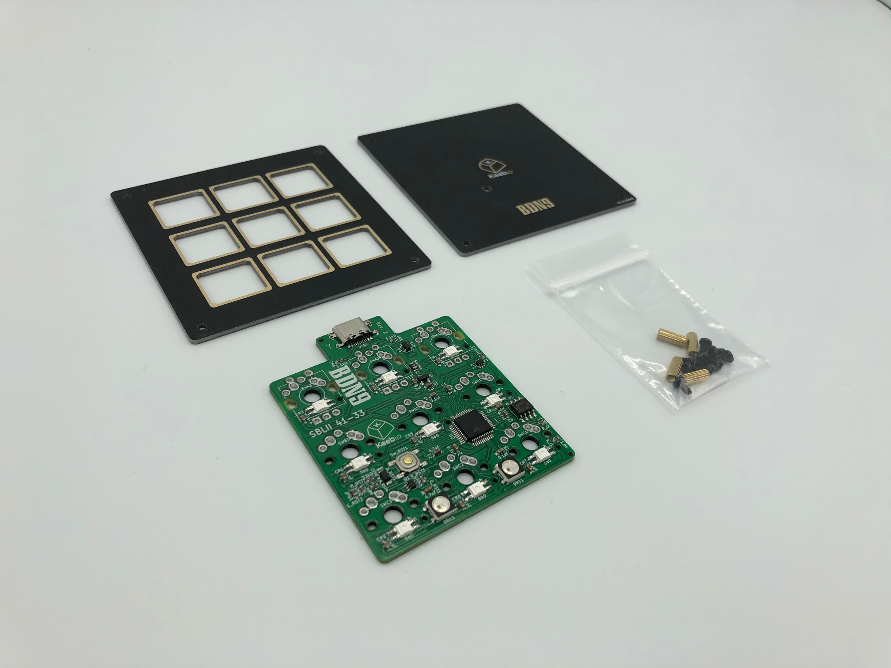
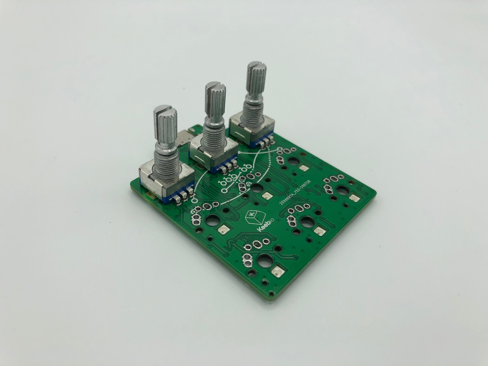
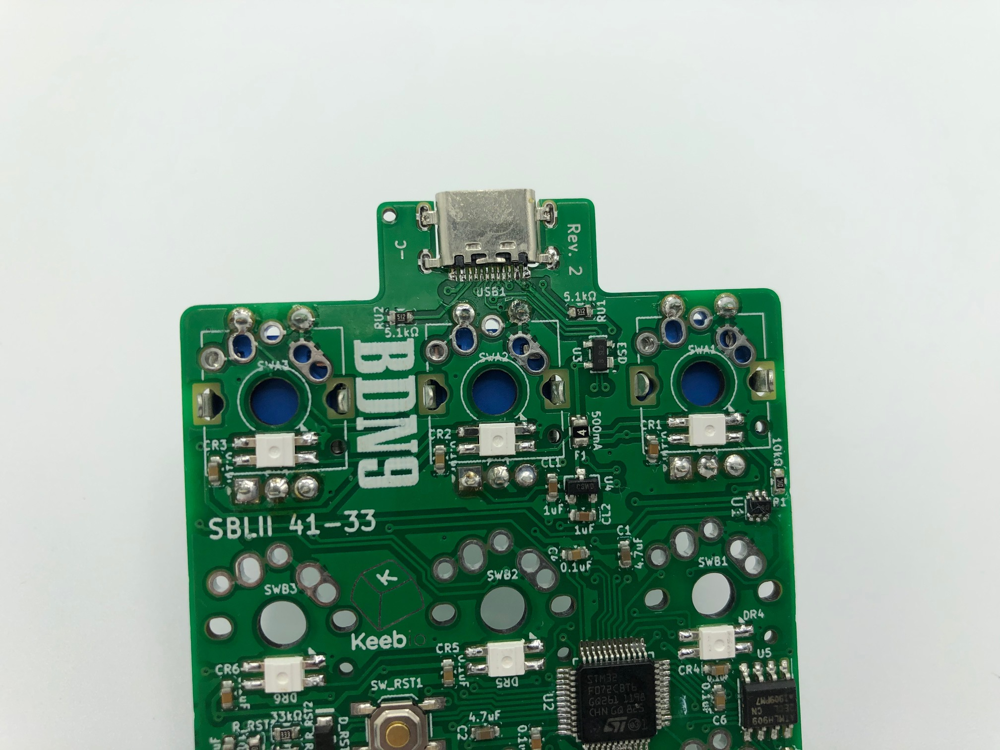
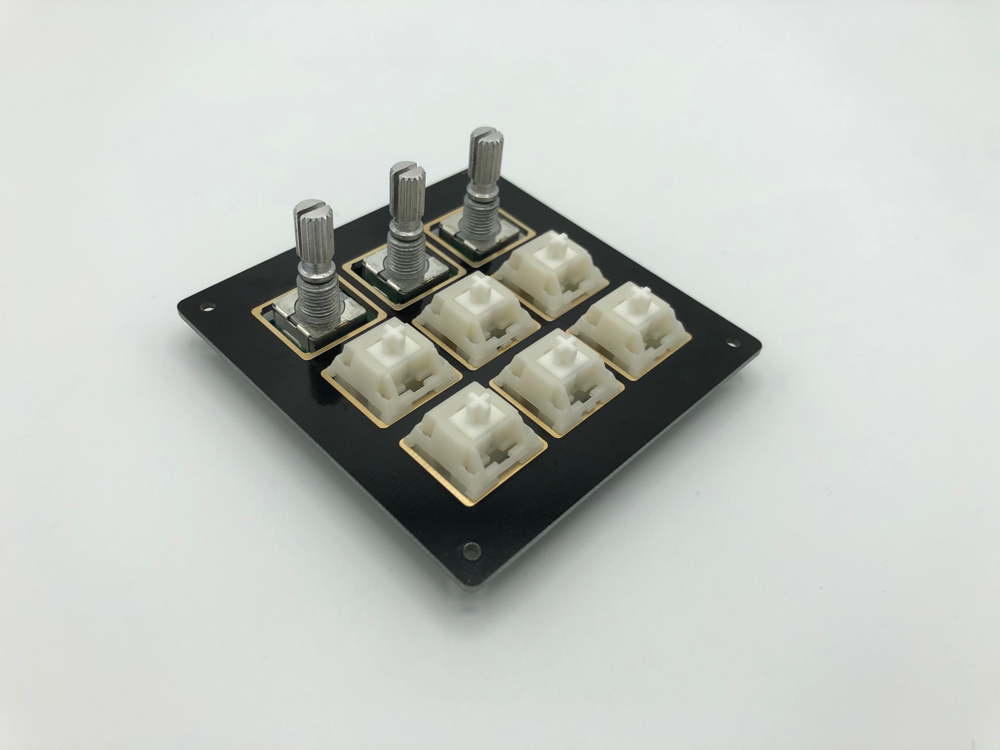
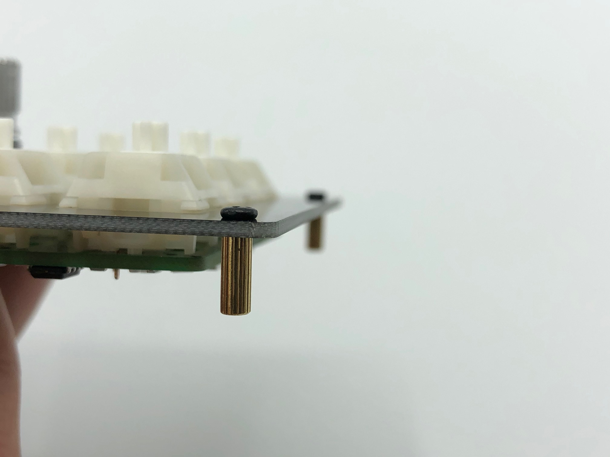
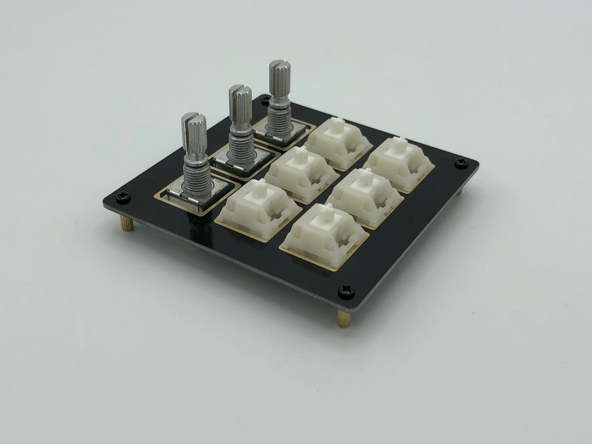
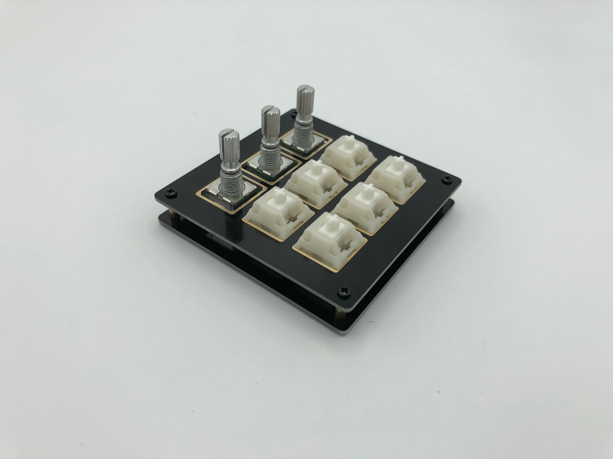

## Parts List

Here's a list of parts needed for the build:

* 1 [BDN9 Rev. 2 PCB & Bottom PCB Plate with M2 screws and standoffs](https://keeb.io/products/bdn9-rev-2-3x3-9-key-macropad-rotary-encoder-and-rgb)
* 6-9 MX-compatible, Alps-compatible, or Choc switches
* Up to 3 [EC11 or EC12 Rotary Encoders](https://keeb.io/products/rotary-encoder-ec11) \(optional)

## Build Steps

Here's a summary of the build steps:

1. Prepare components
2. Solder rotary encoders
3. Solder switches
4. Assemble case

## Prepare components

Parts from the kit.

## Solder Rotary Encoders

:::info Rotary encoders must be soldered on before switches are added
It is difficult to put in the rotary encoders into the PCB pads if the switch plate and switches are already on, so make sure you add the encoders first.
:::

Insert the rotary encoders from the top-side of the PCB.

Solder the rotary encoders in.

:::caution If using Choc low-profile switches, double check/add Kapton tape to solder/metal connections on top of the PCB
When using Choc low-profile switches, there is very little clearance between the switch plate and the top of the PCB. Any exposed metal/solder can cause a short if it touches the switch plate, so before you add the switches to the plate and solder them to the PCB, it's advised that you double check that all solder joints on the top of the PCB are cut flush. Alternatively, you can add Kapton tape to any that are raised. It doesn't hurt to add Kapton tape to the encoder legs as well.
:::

## Solder Switches

First, make sure that the plate is oriented correctly.

For FR4 plates, the rectangular cutouts should have the wider portion oriented horizontally.

For acrylic plates, the 6 square cutouts should be oriented so they are for the middle and bottom row, while the larger holes are for the encoders. The wider part of these larger holes should be oriented vertically.

Once you've figured out the correct orientation, add the switches to the switch plate.

Then, place it on top of the PCB.

Make sure all the switches are seated firmly into the PCB.

Solder the switches onto the PCB.

## Assemble Case

 

Screw in the standoffs to the switch plate at all four corners.

 

Add the bottom plate and screw it in.

Plug it in and test. For the RGB underglow, the mode is controlled by the right-most key in the middle row. If the RGB LEDs don't light up, check your wiring or make sure the pads have enough solder.
