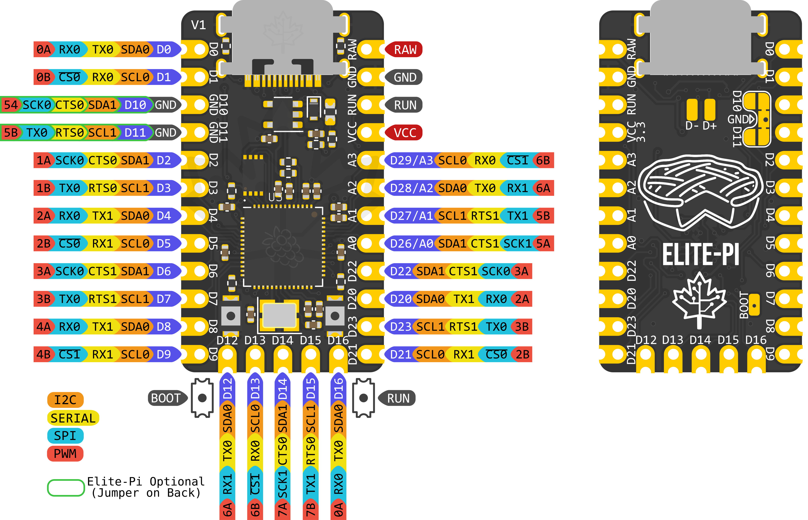

## What is the Elite-Pi?

The Elite-Pi is an RP2040-based controller with a Pro Micro/Elite-C compatible pinout that's primarily intended for use with keyboards.

You can purchase them at your favorite keyboard store: [Elite-Pi at Keebio](https://keeb.io/products/elite-pi-usb-c-pro-micro-replacement-rp2040)

## Features

- Microcontroller: RP2040
- Flash Memory: 16Mbit (W25Q16JVUXIQ)
- Pinout: Pro Micro-compatible
- Number of available pins: Up to 25 I/O pins
- Firmware Support: [QMK](https://docs.qmk.fm/#/platformdev_rp2040), [KMK](https://github.com/KMKfw/kmk_firmware), [CircuitPython](https://circuitpython.org/)
- Mid-mount USB-C to keep low-profile
- Availability: [Elite-Pi at Keebio](https://keeb.io/products/elite-pi-usb-c-pro-micro-replacement-rp2040)

## Advantages over Pro Micro/Elite-C

In comparison to the Pro Micro or Elite-C, the Elite-Pi provides a few advantages over them:

- Flash memory: Lots of space to compile in various QMK features without worry, as the Elite-Pi has much more flash memory 
- Price: Since the RP2040 microcontroller costs less than the ATmega32u4, we can provide it at a lower price than the Elite-C
- Flashing: Instead of using QMK Toolbox, you can just copy a complied `.uf2` file to the Elite-Pi to update the firmware

## Pinout



## Usage Information

### QMK Firmware

The recommended way to use the Elite-Pi is using a converter in QMK. Note that you will not be able to take a `.hex` file compiled for a Pro Micro (ATmega32u4) and rename it as a `.uf2` file, it just doesn't work that way. In either usage case, you will need a [QMK build environment setup](remapping-keyboard#qmk-firmware-build-environment).

#### Converters

If you are using the Elite-Pi on a Pro Micro-compatible board, then you can use a [converter](https://docs.qmk.fm/#/feature_converters?id=converters) in QMK to map the pins correctly to the PCB.

At the moment, the [converter for the Elite-Pi](https://github.com/qmk/qmk_firmware/blob/develop/docs/feature_converters.md#converters) (`elite_pi`) is only present in the `develop` branch of QMK. However, since the pinout is the same as the Pro Micro RP2040, you can use the `promicro_rp2040` converter instead in the meantime, until `develop` is merged into `master`.

To use the converter, see the instructions here: [QMK converter usage](https://docs.qmk.fm/#/feature_converters?id=overview)

##### Examples:

Using QMK CLI:
```js
qmk flash -c -kb keebio/levinson/rev3 -km default -e CONVERT_TO=promicro_rp2040
```

Using `make`:
```js
make keebio/levinson/rev3:default CONVERT_TO=promicro_rp2040
```

#### Without Converter

Alternatively, if you are creating a keyboard from scratch, you can use it as a RP2040 board as described here: [QMK - RP2040 Info](https://docs.qmk.fm/#/platformdev_rp2040).

### Reset/Boot

At the moment with V1 of the Elite-Pi, there are two buttons on it for `Run/Reset` and `Boot`, unlike the Elite-C, where there is only one button needed for `Reset`. The left button is for `Boot`, and the right button is for `Run`. You will mainly be interested in getting the Elite-Pi into bootloader mode, so please see the [directions below](#flashing) for doing this.

In the future, we plan on reducing the Elite-Pi to have just one button to perform `Run` and `Boot`.

### Flashing

The directions to flash the Elite-Pi can be found in the [QMK Documentation in the Flashing section](https://docs.qmk.fm/#/flashing?id=raspberry-pi-rp2040-uf2).

To repeat the information there, here's the steps:

1. Enter bootloader mode (use one of the following methods):
   - For a new Elite-Pi out of the packaging, it will already start in bootloader mode when plugged into the computer
   - Double-tap the `Run/Reset` button (if flashed and was compiled with `RP2040_BOOTLOADER_DOUBLE_TAP_RESET` option)
     - If you used the [converter](#converters) mentioned above, it will have this option enabled
   - Hold the `Boot` button (the left button) down, press the `Run` button (the right button), and release both buttons
   - Hold the `Boot` button (the left button) down, while pluging in the USB-C cable
   - Press the `QK_BOOT` keycode (if present on a flashed keyboard)
2. Wait for OS to detect the Elite-Pi
    - It will show up as a USB mass-storage device named `RPI-RP2`
3. Copy the `.uf2` file to the `RPI-RP2` USB drive

If you have the Elite-Pi installed with the back facing towards you, and you need to press `Boot`, take a wire and connect the `Boot` pad on the back and a `GND` pad, as shown below:


<!-- TODO: Add screenshots of Mac and Windows -->

## Additional Info

### Can I use this on just one half of a split keyboard and use a Pro Micro on the other half?

No, you can not mix the Elite-Pi with a non-RP2040 controller like the Pro Micro or Elite-C.

However, another RP2040 controller can be used with it.
