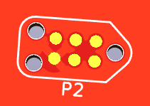
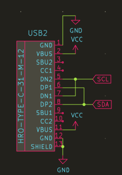

## Flashing

### How do I flash my keyboard with Keyboard Firmware Builder (a.k.a kbfirmware.com)?
Don't use kbfirmware.com as it is outdated and does not support split keyboards. Use [QMK Configurator](https://config.qmk.fm/) instead.

### Do I need to have the TRRS cable (or USB-C to USB-C cable) plugged in while trying to flash both halves?
Having the interconnect cable plugged in between the halves while flashing has zero effect on flashing. Having it plugged in will not flash both halves at the same time.

Flashing does not occur over the interconnect cable, so it does not matter if the interconnect cable is plugged in or not while flashing. Each half needs to be plugged in individually to the USB port to be flashed.

### Do I need to flash both halves of a split keyboard?

This depends on the difference of how old the firmware is on each half of the board. Due to occaisional protocol changes in QMK of how both halves communicate with each other, if it's been a while since you flashed your keyboard, go ahead and flash both halves invidually with the same firmware file.

If both halves have been flashed recently, and you're doing something like updating a keymap, then you will only need to flash the half that will have the USB cable from the computer plugged into it.

When in doubt, flash both halves.

### When I flash the right side by itself, I get the left side, but mirrored. Is something wrong?

Nope, this is perfectly normal!

Here's the explanation why:  

Unless you explicitly do `#define EE_HANDS` in your keymap \(this is not the default\), QMK automatically assumes that whatever half the USB cable is plugged into is the left hand board. Even flashing the .eep files in this case does nothing, as it's ignored unless `EE_HANDS` is explicitly set.

So when you plug in the right board itself, it thinks it's the left one. The reason it's flipped is because the PCB has been physically flipped compared to the actual left board.

When you plug the TRRS cable in, the right side now auto detects correctly as the right side, and the firmware also knows to flip the board.

## Building

### What soldering tools should I get?

We have a list of suggested soldering tools here: [Recommended Soldering Tools](../soldering-tools)

### What's the pinout of the ICSP header on some of the PCBs?

### What's this 2x3 grouping of dots on my PCB?

That's for use with a [Tag-Connect cable](https://www.tag-connect.com/product-category/products/cables/6-pin-target) to do ICSP flashing (to do reflash of bootloader).

### Which way do I orient the diodes?
For all of the boards made by Keebio, the band on the diode (the cathode) is always associated with the square pad. On most boards, the square pad is pointing towards the bottom. For some PCBs that support Kailh Low-Profile switches, the square pad may be pointing towards the top.

**Simple rule to remember:** Band = Square Pad

### Which way do I orient the resistors?
Resistors have no polarity, so the direction they are installed does not matter.

## Lighting & LEDs

### Do any of the PCBs have individually addressable LEDs?
Only the BDN9 Rev. 2 and Iris Rev. 6 has individually addressable per-key RGB LEDs. For all other available Keebio PCBs that have in-switch LED support, the LEDs can only be controlled as a group.

One option around this is to use a switch with clear housing like a Zealio or Alias switch and point RGB LEDs upwards through the switch.

### Which in-switch LEDs are compatible?
Compatible sizes: 1.8mm, 2x3x4mm, or 3mm, note that sometimes the 3mm LEDs can interfere with the keycaps. Voltage should be around 2.7V to 3.3V. Only 2-pin LEDs will work.

2-pin "RGB" LEDs are not really RGB LEDs that are controllable. They are rainbow LEDs that just cycle through various colors on their own and color can't be specified.

Here's a link to some LEDs that will work: [Chanzon 100pcs 2x3x4 LEDs](https://amzn.to/3y9Jgf1)

### Which RGB LED strips are compatible?
- WS2811 and variants (WS2812, WS2812B, WS2812C, etc.)
- SK6812

### Can I add per-key RGB LEDs to a PCB?

Long story short, no, this is not possible. The PCBs need to be designed to have those RGB LEDs installed, and generally in this case, the LEDs will already be pre-soldered onto the board.

One option is to use [these add-on light diffuser PCBs](https://kprepublic.com/products/xd-halo-rgb-light-control-pcb-soft-lighting-light-diffuser-circle-light-for-mechanical-keyboard-cospad-xd60-64-75-84-96-40-68), but these require a significant amount of work to install them.

### What about those 4-pin through-hole LEDs?

No.

## Miscellaneous

### Will you be making the PCB files available for download?
Currently, the only open-sourced PCB design made by Keebio that has been released are:

- [Fourier](https://github.com/keebio/fourier)
- [Quefrency Rev. 1](https://github.com/keebio/quefrency-rev1-pcb)

### How do I contribute to the documentation here?
The repository for this website can be found here: [Keebio Docs on GitHub](https://github.com/keebio/keebio-docs/), we welcome any pull requests

### What the heck is I2C, and what do I need it for?
The default firmware uses serial communication between the two halves using a single pin of the TRRS cable. Serial communication only allow for communication between two parts, which is fine for almost all builds.

However, in the future, there might be additional parts that you can add, like a numpad, OLED screen, etc. To support this, the communication protocol would need to be switched over I2C, which can support multiple devices. Additionally, the latency between halves is lower using the I2C protocol, which can help if you are a fast typer.

To add support for I2C, all you need to do is add the 2 4.7kΩ resistors to one of the halves \(other half does not need them\). Also, it doesn't hurt to add these resistors if using serial communication.

tl;dr: Adding this is optional, but you might as well do it as it's only 2 more components to solder.

### What kind of USB-C to USB-C cable is needed for boards like the Sinc Rev. 2 and Quefrency Rev. 3 that uses USB-C for interconnect?

Most USB-C to USB-C cables should work, as long as they have the following pins in the cable:

- VCC
- GND
- D+
- D-

All the [USB-C to USB-C cables](https://keeb.io/products/usb-c-to-usb-c-cable) sold at Keebio are compatible.

Below is a schematic of how the pins are used:

