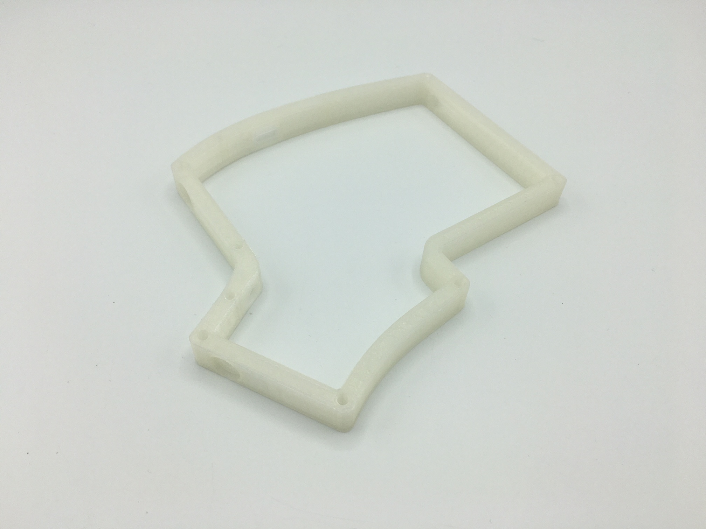
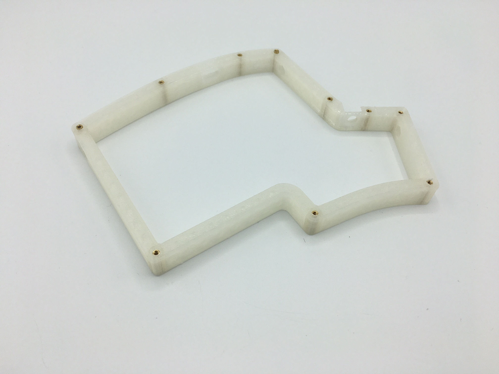
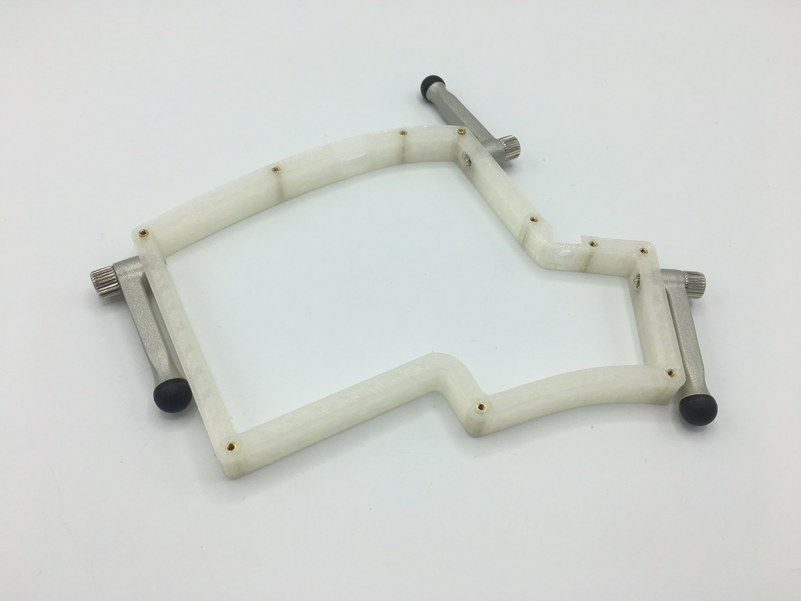
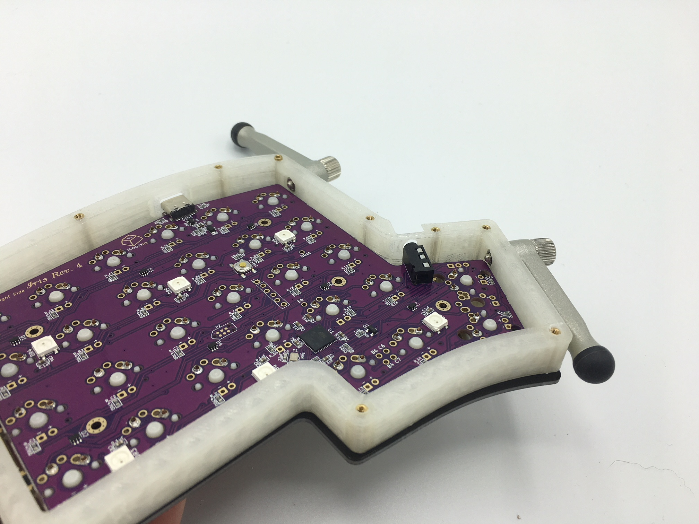
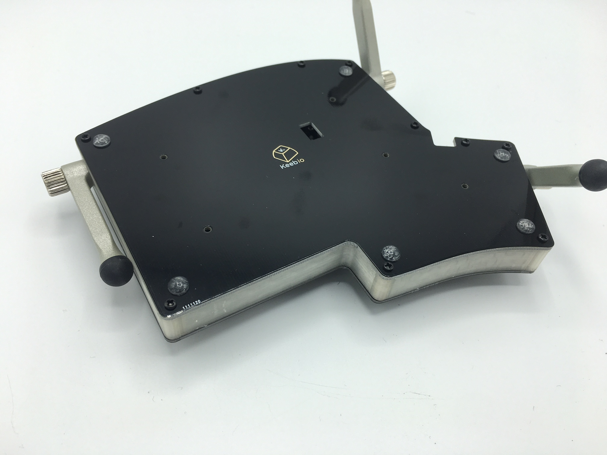
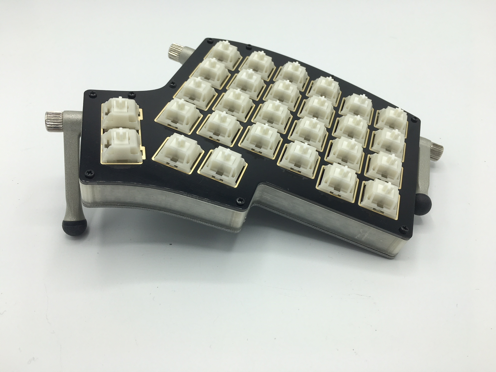

### Parts List
You've got the hip 3D-printed middle layer for your Iris, eh? Smashing! Get the rest of the items in the list below and we'll get you putting everything together in no time.
+ [Iris 3D-Printed Mid](https://github.com/keebio/iris-case/tree/master/rev3-and-rev4) - With or without Ergodox leg support
    + The STL files are for the left half. To get the right half, just mirror the STL file in whatever slicer program you are using to do the print
+ [Ergodox EZ Tilt/Tent Kit](https://ergodox-ez.com/products/tilt-tent-kit?variant=16101844419) These are the legs that will tent and prop up your Iris. Keebio doesn't sell this, but the nice folks in matching socks over there can help you nab one.
+ [Iris PCB](https://keeb.io/collections/iris-split-ergonomic-keyboard/products/iris-keyboard-split-ergonomic-keyboard)
+ [Iris plates/acrylic case](https://keeb.io/products/iris-keyboard-case-plates?_pos=1&_sid=cfc4889a9&_ss=r)
+ 11mm M2 standoffs 
+ M2 screws from your plate kit
+ M3 nuts - The Ergodox EZ legs will screw into these nuts
+ Tweezers (the kind with the very pointed nose) or Drill

### Video Tutorial

<iframe width="560" height="315" src="https://www.youtube.com/embed/dcyA0YOCJXs" title="YouTube video player" frameborder="0" allow="accelerometer; autoplay; clipboard-write; encrypted-media; gyroscope; picture-in-picture" allowfullscreen></iframe>

### Overview
Your goal at the end of this guide is to have your Iris PCB sitting cozy inside the 3D printed layer with some rockin' legs. This can be tricky, but that's why we have this guide for you!

#### Steps
1. Test your Iris build
2. Prep the 3D-printed mid
3. Insert standoffs and nuts
4. Add Legs
5. Align middle layer onto PCB ports
6. Secure plates to middle layer
7. Adjust legs
8. Repeat for other half of Iris
9. Rejoice!

If you'd like to watch a video of this process, check out the video we've posted up here!: [Iris Tenting w/3D-printed Mid](https://youtu.be/dcyA0YOCJXs)

### 1. Test your Iris build
We always verify this in-house, but to be extra sure you've got everything working right this is a good idea. Wouldn't want to have everything assembled then find something critical didn't work, right? Good to practice that proactive energy!

Here's some handy info on testing your build/PCB: [Testing Your PCB](testing-pcb).

### 2. Prep the 3D-printed mid

3D printing is a beautiful thing. It also tends to need a little care after printing. To remove any debris that might be left in the holes for your standoffs, take your tweezers/pointed tool and gently pivot it inside the opening.

Do this for each of the holes, and then it'll make step 3 *much* easier. You can also use a drill as well to widen any holes that are too tight.

### 3. Insert standoffs and nuts
Now go ahead and drop in your standoffs into each of the holes.

After accomplishing standoff placement, you can now do the exciting part of adding the 3 nuts into the carved out spaces made especially for them. 

### 4. Add legs
With the nuts inserted, you can now cinch down the Ergodox EZ pieces into the outer sides of the Iris middle layer.

Put the spring over the thumbscrew and then insert them through the leg. Afterwards screw it into the nut and tighten.

### 5. Align middle layer onto PCB ports
This part is a little tricky, so if you're having a hard time, don't give up! We also have a [video](https://youtu.be/dcyA0YOCJXs) to help you out.

You want to gently nest the two port cutouts on the middle piece onto the USB-C and TRRS jacks. **Be sure** to nest it properly or you'll have a really hard time reversing this process. Start with the TRRS jack first, and then align the USB-C port.

But hey, once you have everything all cozy, your Iris now officially has Ergodox legs! Fancy that.

### 6. Secure plates to middle layer
Flip the board over and screw in the switch plate to the middle layer standoffs.

After that, flip the board over again and screw on the bottom plate.

### 7. Adjust legs
Now that you've sandwiched the middle layer in between the switch plate and the bottom plate, play around with the legs to get everything angled the way you like it.

### 8. Repeat for other half of Iris
That's right! You're halfway there. Repeat this process one more time and you'll have yourself a lovely tented Iris!

### 9. Rejoice!
You're done! Enjoy your hard work, friend.
