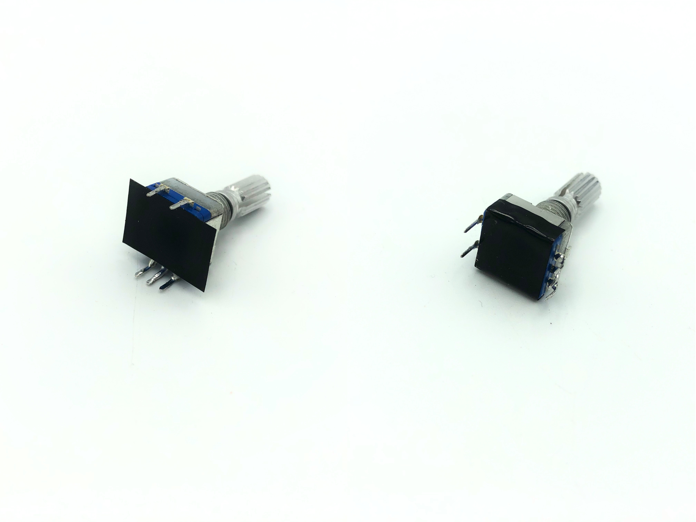
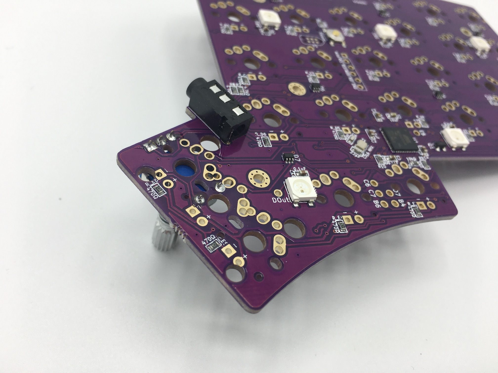
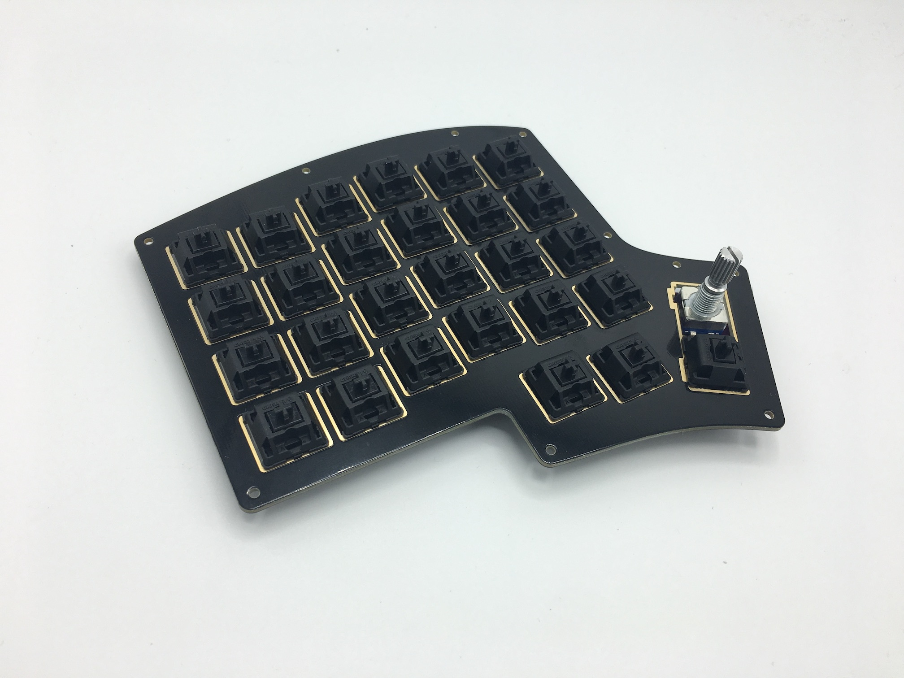
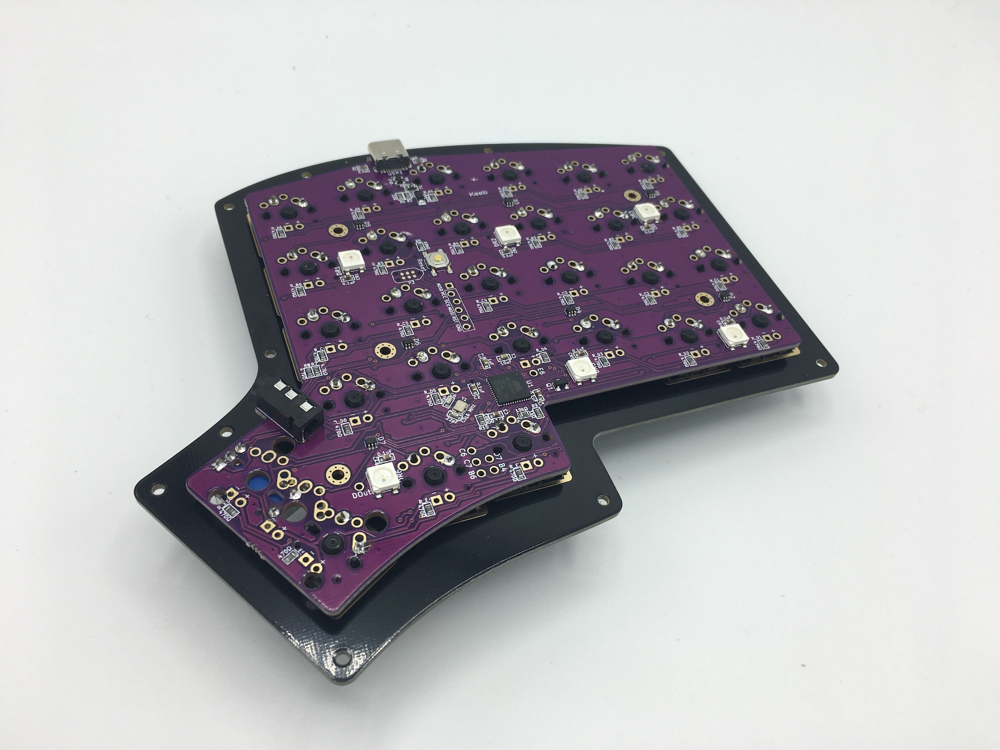
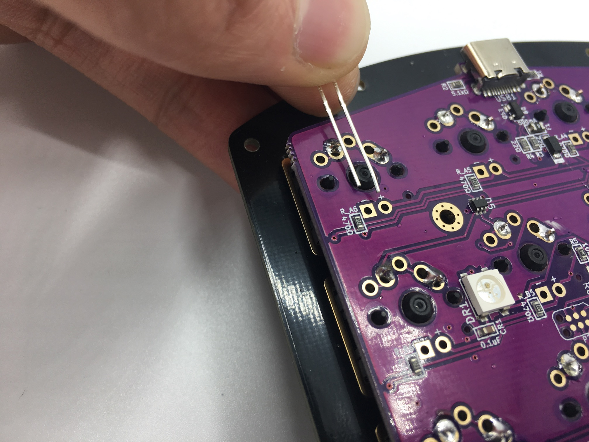
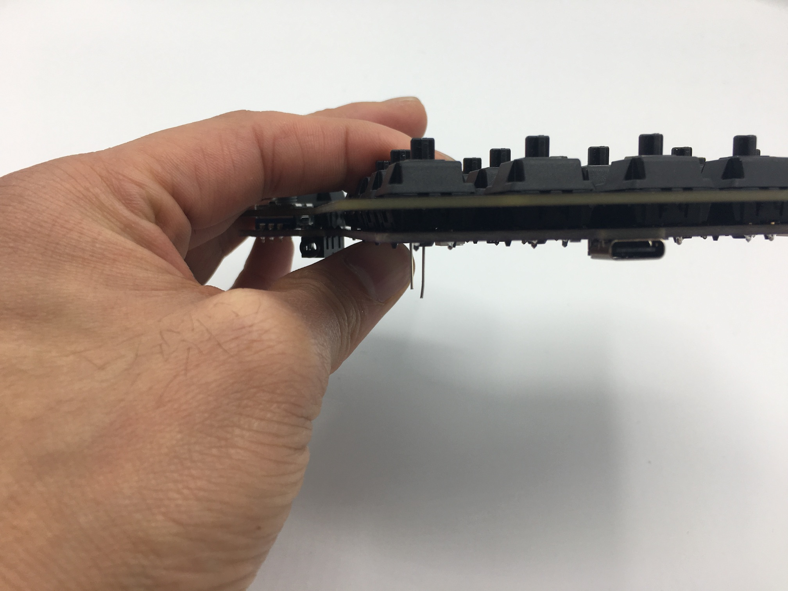
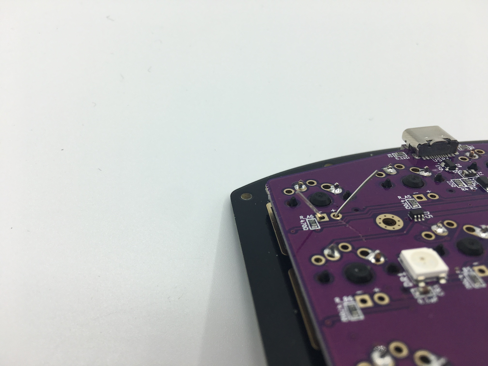
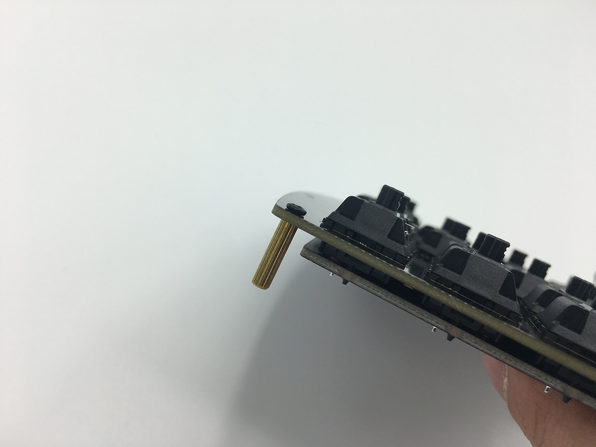
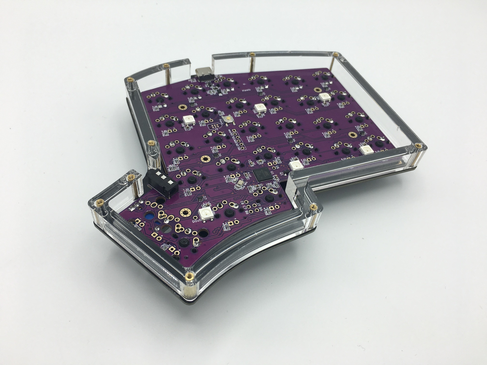
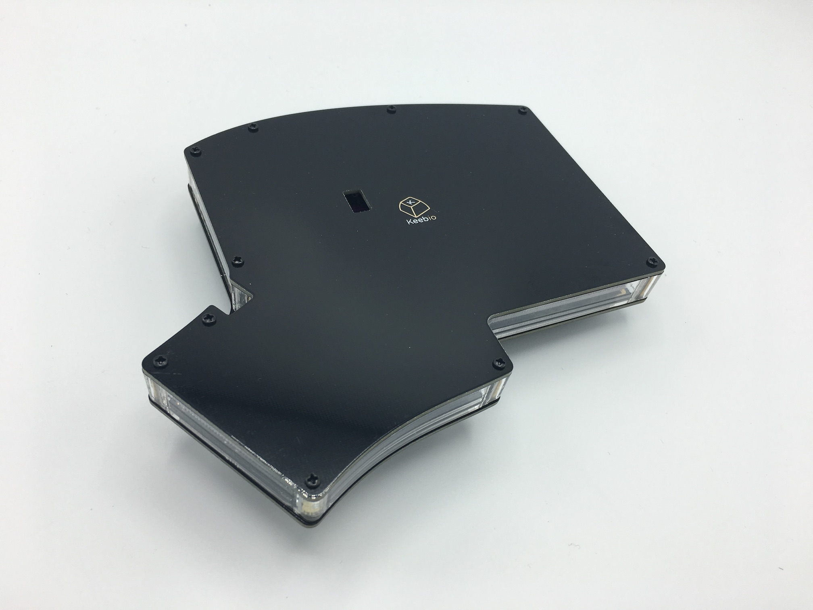

## Build Compatibility

This build guide is exclusively for Rev. 3-5 of the Iris, which features pre-soldered components. For Rev. 2 PCBs, see [Iris Rev. 2 Build Guide](iris-rev2-build-guide).

This guide can also be used for the Nyquist Rev. 3, as it has a very similar construction. 

## Videos of Builds

* [MechMerlin - Build Stream: Keebio Iris Rev 3 Build](https://www.youtube.com/watch?v=SZkzzIPx35o)
* [TaeKeyboards - Iris Split Ergonomic Mechanical Keyboard Build](https://www.youtube.com/watch?v=0P6oIOB-whM&t=219s)

### Build Tutorial Video by Keebio

<iframe width="560" height="315" src="https://www.youtube.com/embed/Vsp-8rp1NqM" title="YouTube video player" frameborder="0" allow="accelerometer; autoplay; clipboard-write; encrypted-media; gyroscope; picture-in-picture" allowfullscreen></iframe>

## Parts List

Here's a list of parts needed for the build:

* [Set of Iris PCBs](https://keeb.io/products/iris-rev-5-keyboard-pcbs-for-split-ergonomic-keyboard)
* [Iris Case/Plates](https://keeb.io/products/iris-keyboard-case-plates-phoenix-edition)
* Interconnect Cable:
    * 1 [TRRS cable](https://keeb.io/products/trrs-cable) (For Rev. 3 or 4)
    * 1 [USB-C to USB-C cable](https://keeb.io/products/usb-c-to-usb-c-cable) (For Rev. 5 or 6)
* 54-56 switches (MX-compatible and Alps switches are supported)
* Optional parts (not shown)
    * [2u PCB mount MX stabilizers](https://keeb.io/products/cherry-mx-stabilizer) if using 2u keys
    * [Rotary Encoder](https://keeb.io/products/rotary-encoder-ec11) and [Knob](https://keeb.io/products/rotary-encoder-knob-ec11)
    * [Iris Middle Layer](https://keeb.io/products/iris-keyboard-case-plates)

## Build Steps Summary

1. Prepare components
2. Optional additions! 
    * Solder [rotary encoder](glossary#rotary-encoder) (optional)
    * Solder in-switch [LEDs](glossary#led) (optional)
3. Add [stabilizers](glossary#stabilizers) to [PCB](glossary#pcb)
4. Add switches
5. Optional additions! Part 2
    * Solder in-switch LEDs 
6. Assemble! 
7. Re-Program Board Note
8. Rejoice!

## Prepare Components

Have your soldering iron, solder and, if you feel accident prone with your soldering (it's ok! Happens to the best of us!), a solder sucker.

Some individuals may want to lubricate their switches. If you'd like to, go ahead and do that now before starting the process. For further details on that, go [here](https://www.maketecheasier.com/how-to-lubricate-keyboard-switches/).

<!-- TODO: make keebio version of the 'how to' on the aforementioned page. -->

Get a playlist of some jams you like and get started!

## Optional additions!

These items are optional additions, but if you *do* want them included in your board, the time to act is now. 

### Add 2u stabilizers to PCB 

Add the 2u stabilizer if desired. Do this before installing the switch plate and switches:

### Solder rotary encoder

If adding a rotary encoder, clip the two larger mounting pins on the encoder so it can fit onto the PCB:

Next, add a small piece of electrical tape to cover up the clipped off pins:

Install the encoder onto the PCB:

Solder the encoder onto the PCB:

### Add buffer for acrylic plates

If you are using acrylic plates, you may want to add something in between the bottom side of the plate and the top of the PCB. This prevents the plate from shifting around, since for a 3mm plate, the switches are unable to clip in.

Here, rolled up pieces of electrical tape is being added to the bottom of the plate before being placed onto the PCB:

## Add switches
:::note FOR KALIH BOX AND KAILH CHOC SWITCHES - INSTALL LEDS BEFORE THIS STEP
For Kailh Box and Kailh Choc switches, there is no cutout to insert in-switch LEDs through, so the LEDs must be added first. Skip to the [LED installation step](iris-rev3-build-guide#solder-in-switch-leds) and then come back to this step of switch installation.
:::

Add switches into the switch plate. It's a good idea to add switches to the corners first and then solder them before installing the rest of them:

Fit the switches and plate onto the PCB:

Solder the switches onto the PCB:

Add the rest of the switches:

Solder the rest of the switches onto the PCB:

## Optional additions! Part 2

### Solder in-switch LEDs

Polarity of the in-switch LEDs is important. Match up the longer leg of the LED to the `+` sign of the LED pins on the PCB:

Insert the LED through the switch and PCB:

Double check that the longer leg matches with the `+` sign:

Bend the LED legs out so it doesn't fall out while soldering the LED in:

Solder the LED legs and then clip the excess length on the legs:

## Assemble!

Insert a screw through the top of the switch plate and attach a standoff from the bottom side of the plate:

Repeat the process for the rest of the plate:

#### Assembly Option!

If you have an acrylic middle layer, insert it now around the standoffs:

Put the bottom plate on and add screws:

If you have an acrylic middle layer with tenting holes, here's a video on how to add bolts to it: [Tenting Your Iris with Bolts](https://youtu.be/kxwHtumvQmc)

If you have a 3D-printed middle layer, see this page on installing it: [Iris 3D-printed Middle Layer Installation](iris-middle-layer)

## Re-Program Board Note

Oh, looking to re-program your board? Never fear! Come look [here](flashing-firmware).

## Rejoice!

You have a keyboard! Savor this moment of victorious keyboard construction.

Care for [another](https://keeb.io/collections/all) build adventure? 
