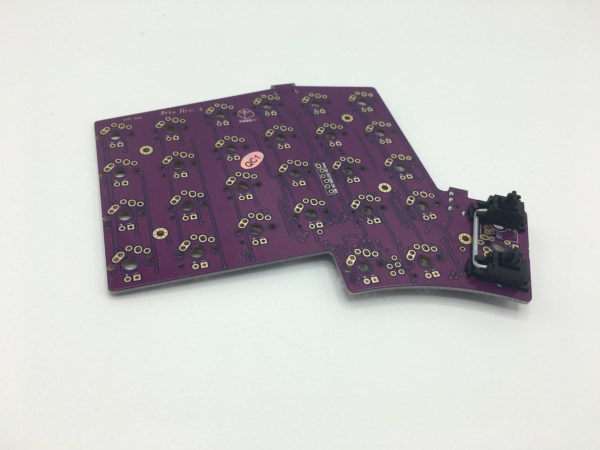
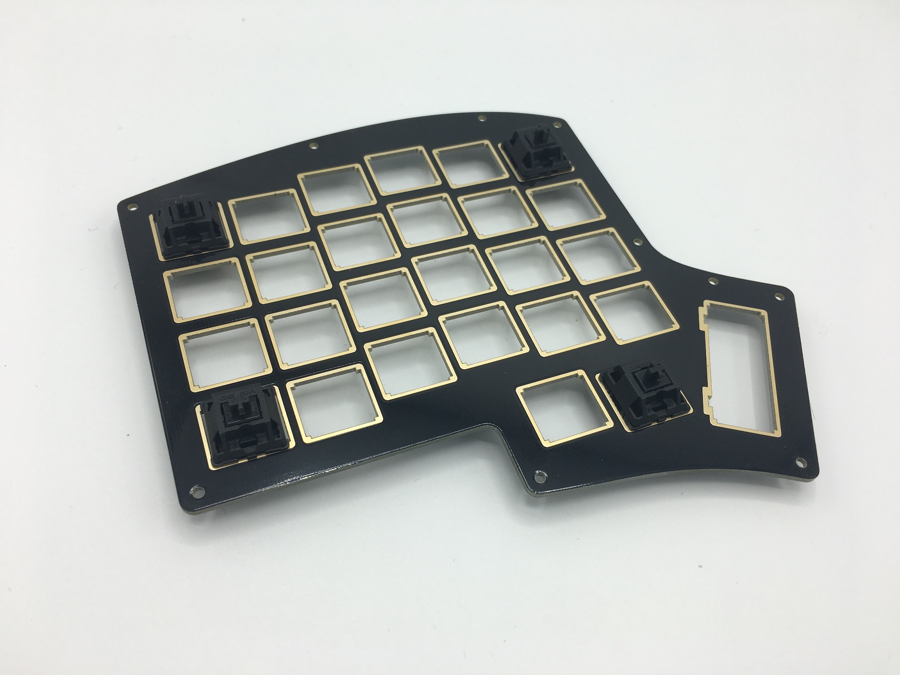
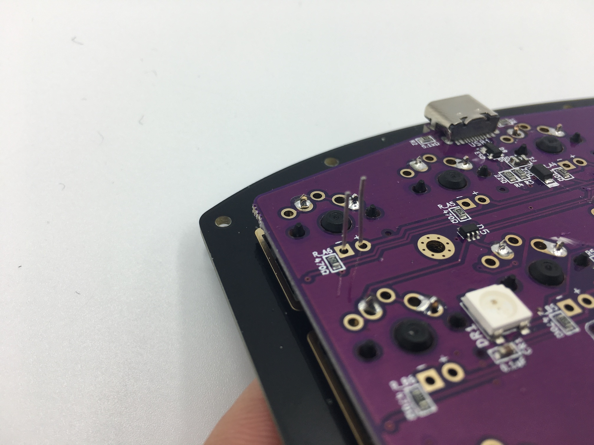

## Build guide compatibility

This build guide is exclusively for Rev. 3 & 4 of the Iris, which features pre-soldered components. For Rev. 2 PCBs, see [Iris Rev. 2 Build Guide](iris-rev2-build-guide.md)

This guide can also be used for the Nyquist Rev. 3, as it has a very similar construction.

## Parts List

Here's a list of parts needed for the build:

* [Set of Iris Rev. 4 PCBs](https://keeb.io/products/iris-keyboard-split-ergonomic-keyboard)
* [Iris Case/Plates](https://keeb.io/products/iris-keyboard-case-plates)
* 1 [TRRS cable](https://keeb.io/products/trrs-cable)
* 54-56 switches (MX-compatible and Alps switches are supported)
* Optional parts \(*not shown*\)
    * [2u PCB mount MX stabilizers](https://keeb.io/products/cherry-mx-stabilizer) if using 2u keys
    * [Rotary Encoder and Knob](https://keeb.io/products/rotary-encoder-ec11)
    * [Iris Middle Layer](https://keeb.io/products/iris-keyboard-case-plates)

## Build Steps

Here's a summary of the build steps:

1. Add 2u stabilizers to PCB \(optional\)
2. Solder rotary encoder \(optional\)
    1. For Rev. 4 PCB, clip off the 2 side mounting legs of the rotary encoder.
3. Add switches to switch plate
4. Solder switches
5. Solder in-switch LEDs \(optional\)
    * Note: For Choc switches or Kailh Box switches, LEDs must be installed before the switches.
6. Assemble case
    1. Insert standoffs into middle layer \(optional\)
    2. Screw standoffs into switch plate
    3. Attach bottom plate using screws
7. Re-program board \(optional)
    1. VIA Configurator or
    2. QMK Configurator or
    3. QMK

## Add 2u stabilizers to PCB \(optional\)

Add the 2u stabilizer if desired. Do this before installing the switch plate and switches: 

## Solder rotary encoder \(optional\)

If adding a rotary encoder, clip the two larger mounting pins on the encoder so it can fit onto the PCB 

Next, add a small piece of electrical tape to cover up the clipped off pins 

Install the encoder onto the PCB: 

Solder the encoder onto the PCB: 

## Add switches to switch plate and solder

:::caution For Kailh Box and Kailh Choc Switches - Install LEDs before this step
For Kailh Box and Kailh Choc switches, there is no cutout to insert in-switch LEDs through, so the LEDs must be added first. Skip to the LED installation step and then come back to this step of switch installation.
:::

Add switches into the switch plate. It's a good idea to add switches to the corners first and then solder them before installing the rest of them: 

Fit the switches and plate onto the PCB: 

Solder the switches onto the PCB: 

Add the rest of the switches: 

Solder the rest of the switches onto the PCB: 

## Solder in-switch LEDs \(optional\)

Polarity of the in-switch LEDs is important. Match up the longer leg of the LED to the + sign of the LED pins on the PCB: 

Insert the LED through the switch and PCB: 

Double check that the longer leg matches with the + sign: 

Bend the LED legs out so it doesn't fall out while soldering the LED in: 

Solder the LED legs and then clip the excess length on the legs: 

## Assemble case

Insert a screw through the top of the switch plate and attach a standoff from the bottom side of the plate: 

Repeat the process for the rest of the plate: 

(Optional) If you have a acrylic middle layer, insert it now around the standoffs: 

Put bottom plate on and add screws: 