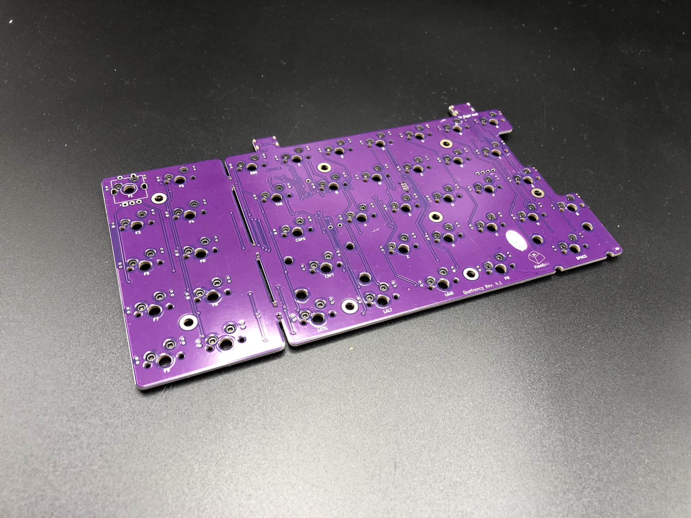
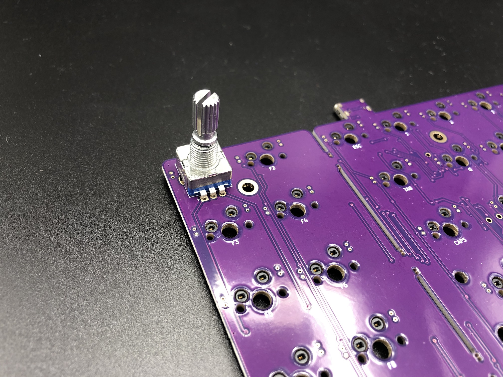
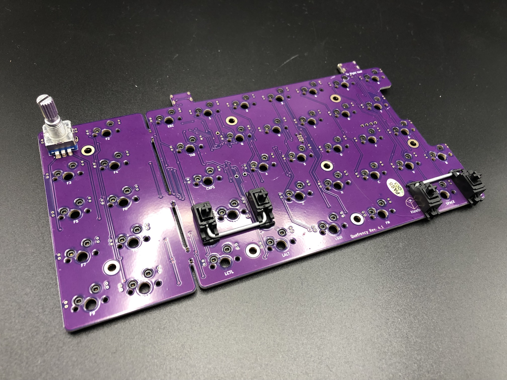
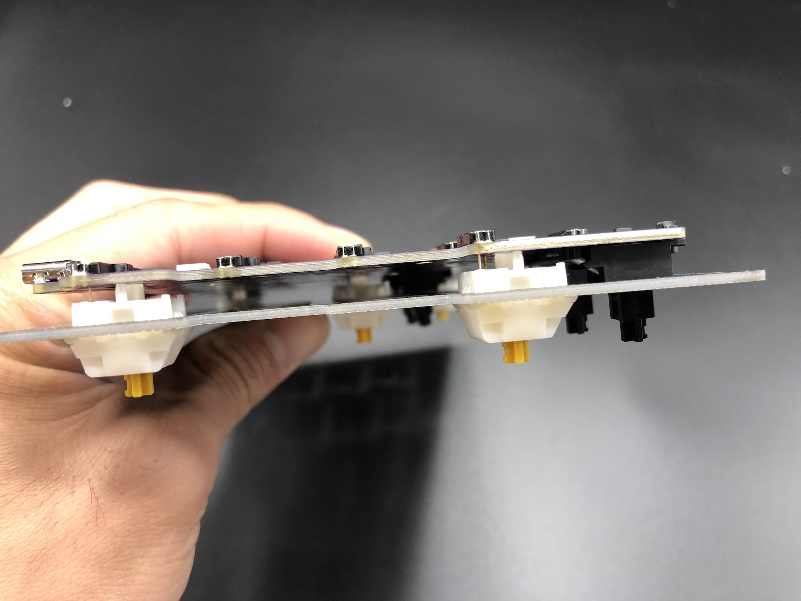
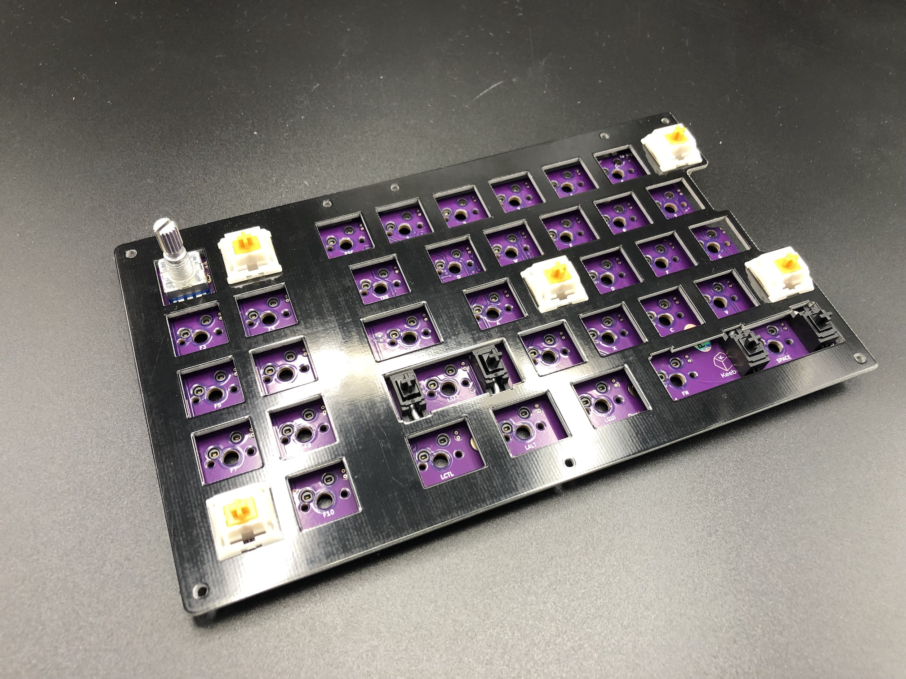
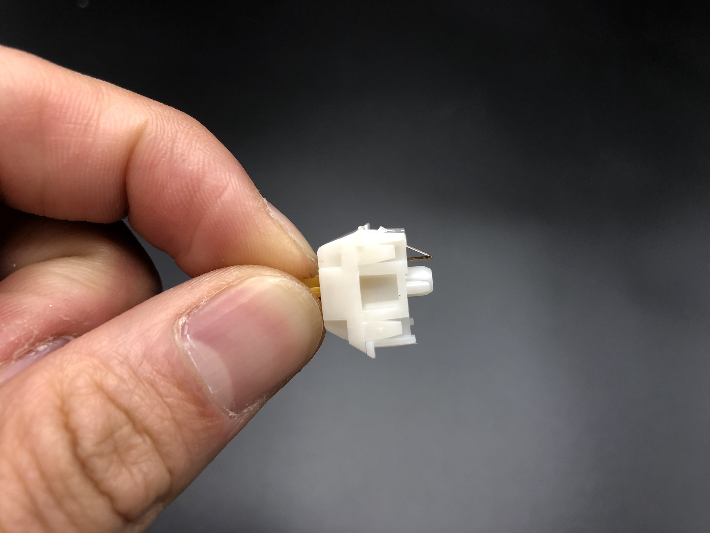
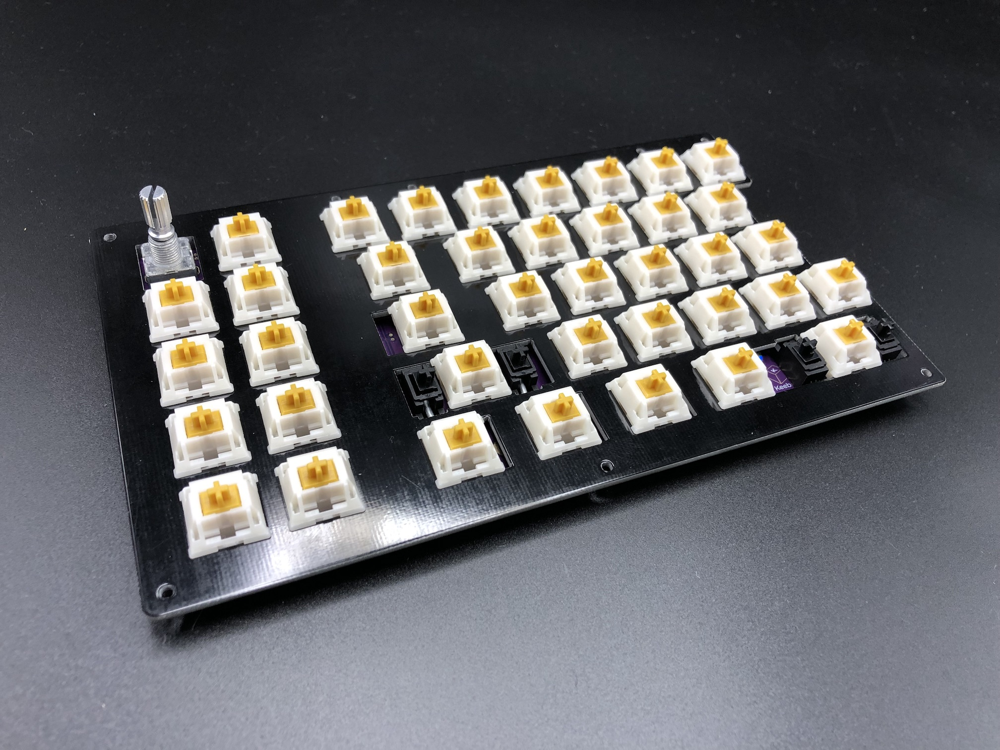
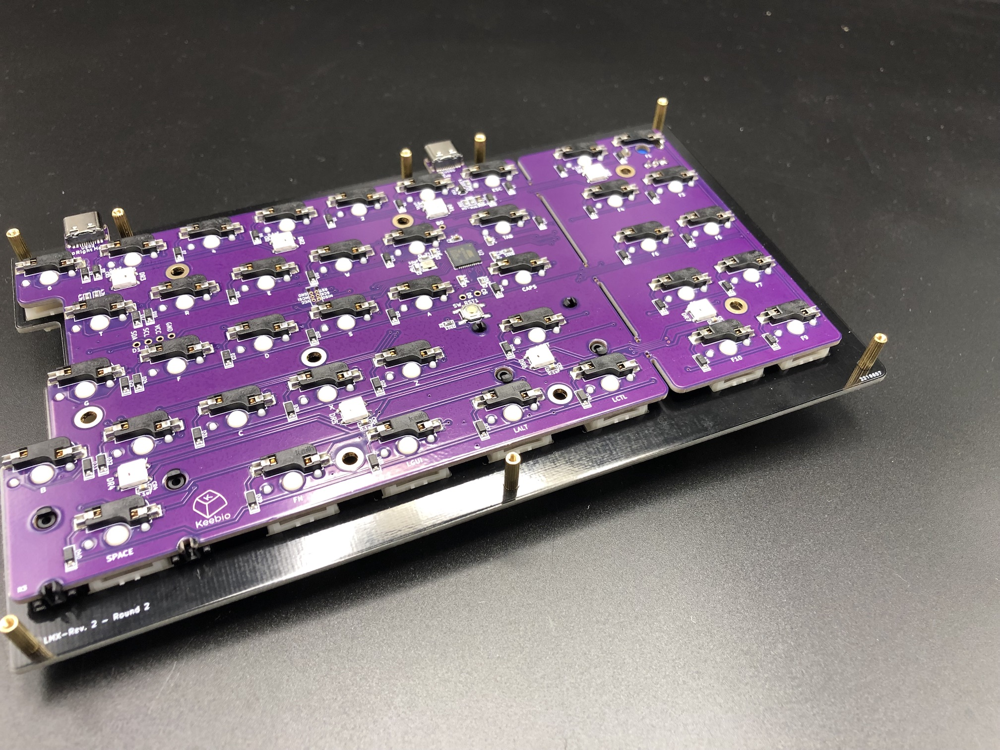
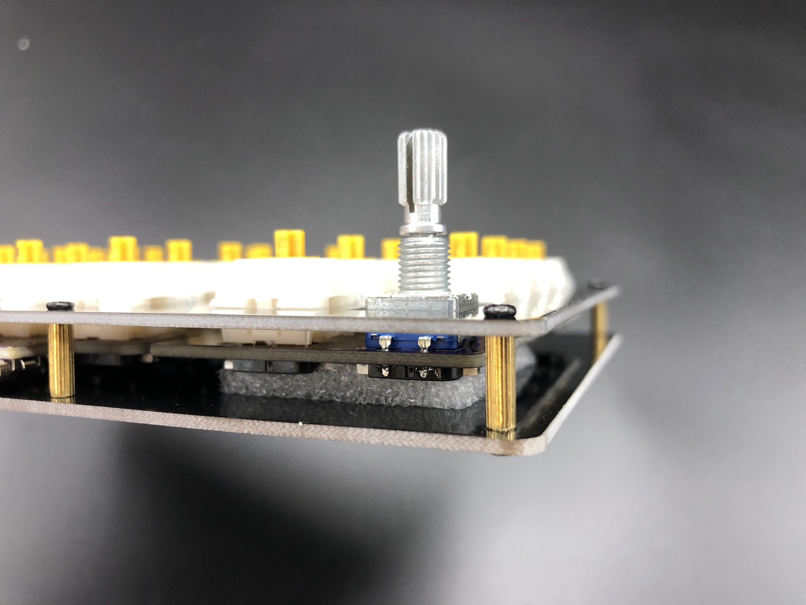
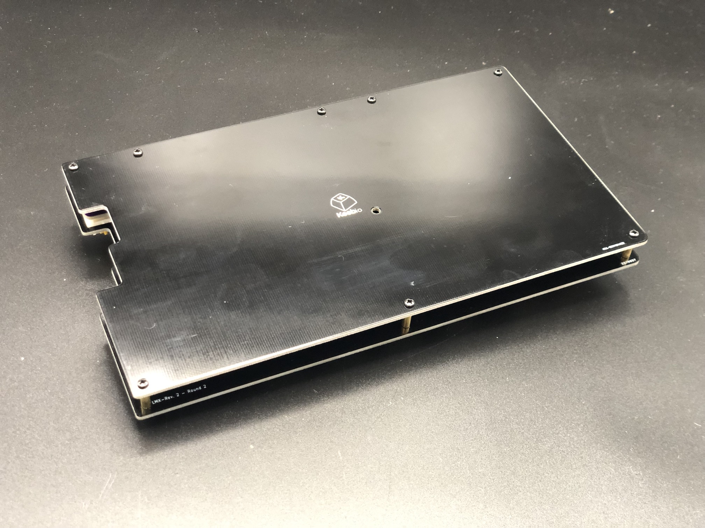

## Build Compatibility

This build guide is for the Quefrency Rev. 4, which has Kailh hotswap sockets. If you have the Quefrency Rev. 2 or 3 PCBs, see [Quefrency/Sinc/KBO-5000  Build Guide](quefrency-rev2-sinc-build-guide.md).

### Build Tutorial Videos by Keebio

<iframe width="560" height="315" src="https://www.youtube.com/embed/ONEaWsojIn0" title="YouTube video player" frameborder="0" allow="accelerometer; autoplay; clipboard-write; encrypted-media; gyroscope; picture-in-picture" allowfullscreen></iframe>

## Parts List

Now you've watched some cool videos and feel inspired! Get your parts:

* [Set of Quefrency Rev. 4 PCBs](https://keeb.io/products/quefrency-rev-4-65-split-staggered-keyboard)
* [Plates for Quefrency](https://keeb.io/products/quefrency-fr4-plates)
* [USB-C to USB-C cable](https://keeb.io/products/usb-c-to-usb-c-cable) (for boards that use USB-C for interconnect)
* Switches (MX-compatible ones)
* [2u PCB mount MX stabilizers](https://keeb.io/products/cherry-mx-stabilizer) if using 2u/2.25u/2.75u keys
* [Rotary Encoder](https://keeb.io/products/rotary-encoder-ec11) and [Knob](https://keeb.io/products/rotary-encoder-knob-ec11)

## Build Steps Summary

1. Break off PCB sections
2. Solder [rotary encoder](glossary#rotary-encoder) (optional)
3. Add 2u [stabilizers](glossary#stabilizers) to [PCB](glossary#pcb)
4. Add switches
5. Assemble!
    * Screw [standoffs](glossary#standoffs) into switch plate
    * Attach bottom plate using screws
6. Re-Programing Board Note
7. Rejoice!

## Break Off PCB Sections

If you're going to go with a layout without the left macro section or right macro column, then break off those portions of the PCB. No special tools or methods are required, you can just break it off with your hands as shown below:

<video width="100%" controls muted loop>
  <source src="/videos/pcb-break.mp4" type="video/mp4" />
</video>

### Solder Rotary Encoder

Install the encoder onto the PCB and solder the 2 pins at the top side of the encoder and the 3 pins at the bottom side. The 2 side legs do not need to be soldered to the PCB.

## Add 2u stabilizers to PCB

Add the 2u stabilizers into the PCB. The stab wire will be on the bottom side of the switch for everywhere except for the bottom row. On the bottom row, the stab wire will be above the switch. Do this before installing the switch plate and switches, as stabilizers can not be removed without needing to remove all of the switches.

## Add Switches

Now on to the exciting part: putting the switches in the switch plate.

Add switches into the switch plate. It's a good idea to add switches to the corners **first** before installing the rest of them:

Make sure all of the switch pins are straight, or else they will not fit into the hotswap sockets properly and will bend the switch pins and/or damage the hotswap socket and PCB.

Align the PCB over the switch pins, checking again that everything is straight.

Squeeze the switches into the hotswap sockets, it should not take very much force at all.

If you encounter a bent switch pin like below, bend it back with your fingers or a tweezer.

After the first few switches have been inserted, add the rest of them.

## Assemble!

Now that all of the switches are in, install the standoffs. Insert a screw through the top of the switch plate and attach a standoff from the bottom side of the plate

If you installed an encoder, you will need to add a piece of foam about 3-4mm thick that will sit in between the bottom of the PCB and the bottom plate. This will prevent the PCB from dislodging from the switches when pressing down on the encoder.

Put the bottom plate on top of the standoffs and screw it on.

All done now, repeat for the other half of the board!

## Re-Programming Board Note

Oh, looking to re-program your board? Never fear! Come look [here](flashing-firmware).

## Rejoice!

You have a keyboard! Savor this moment of victorious keyboard construction.
