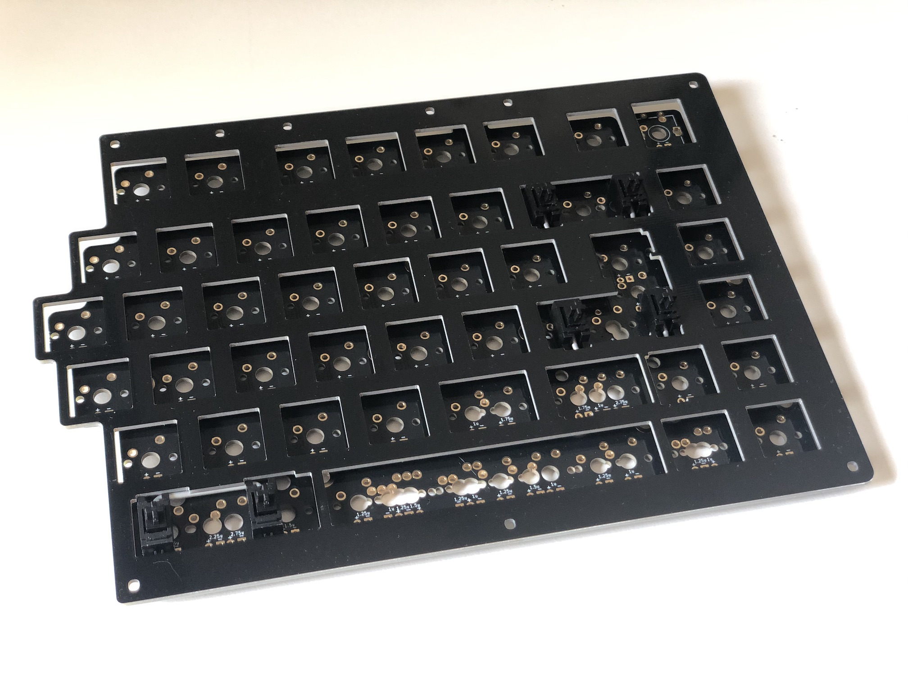
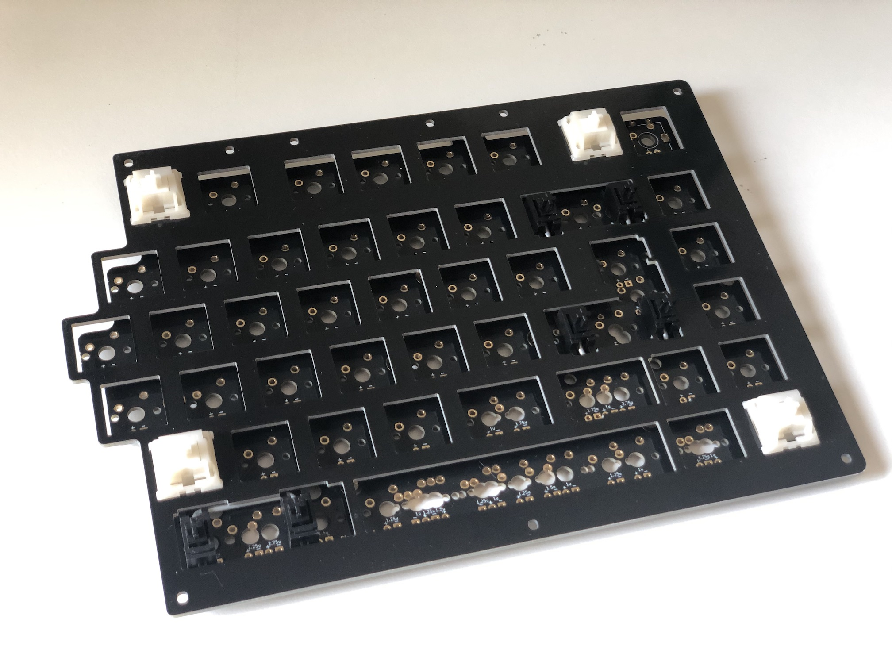
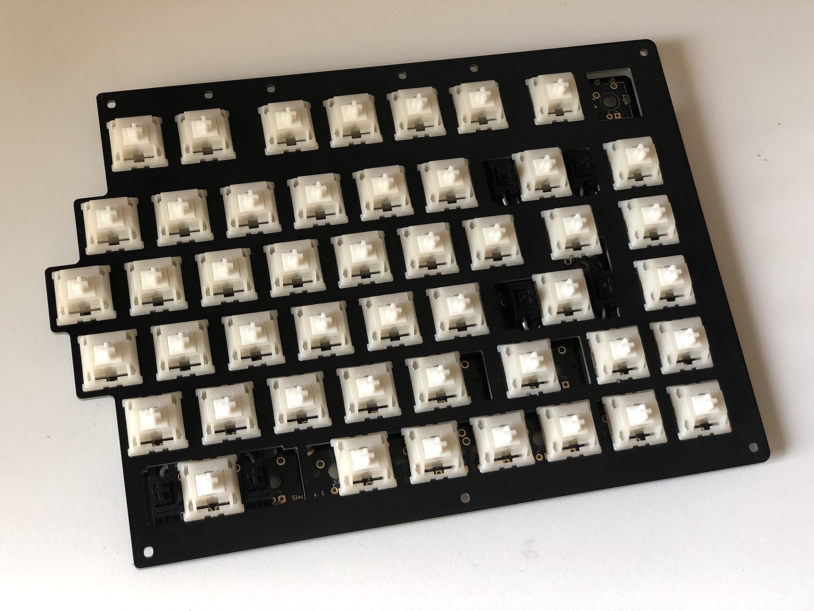
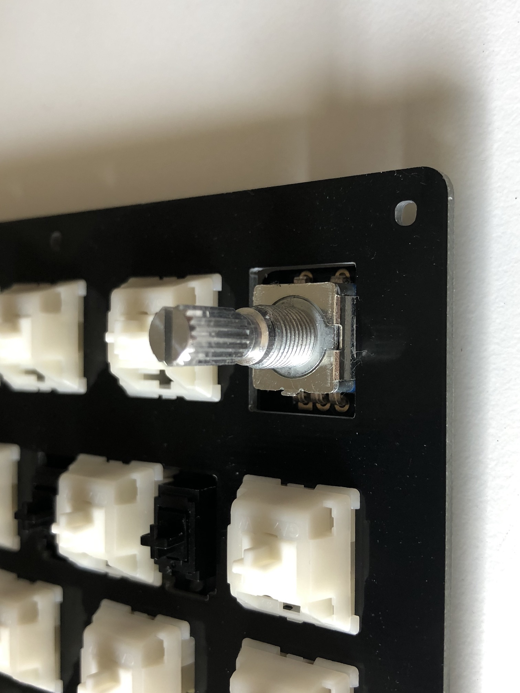
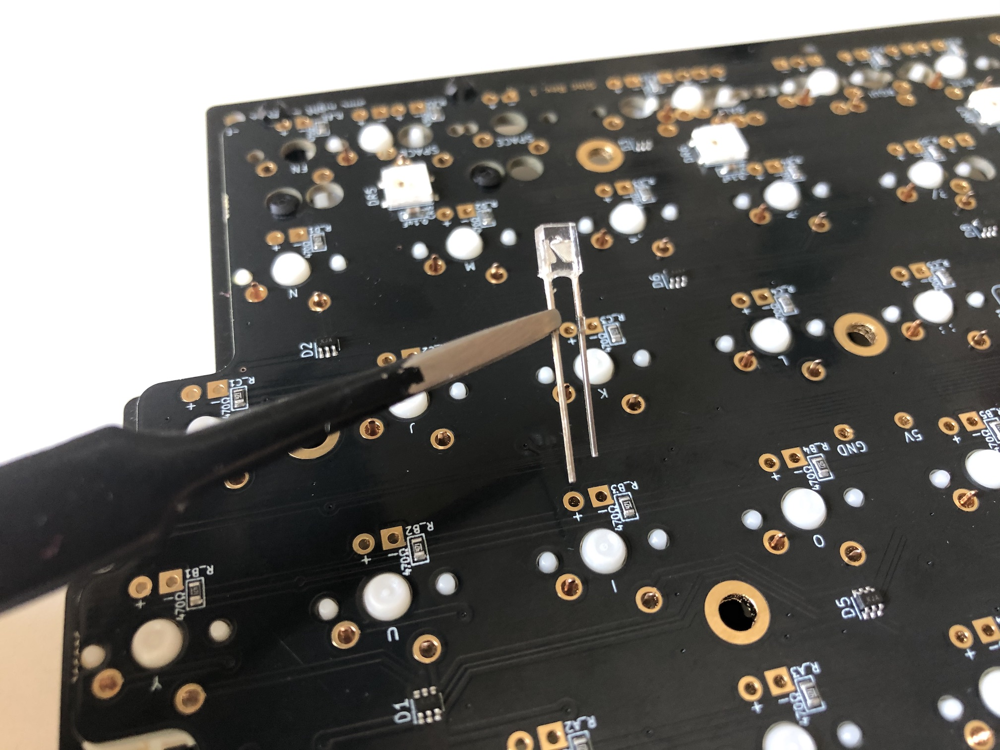
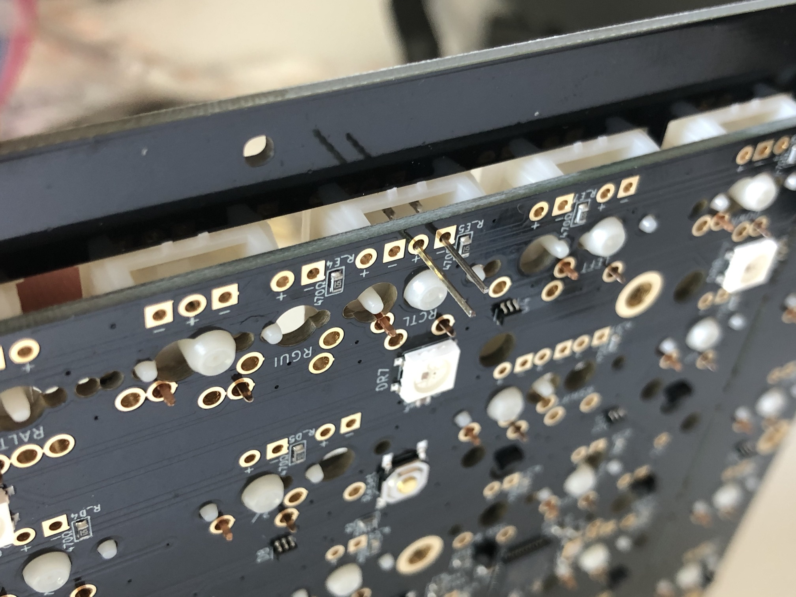
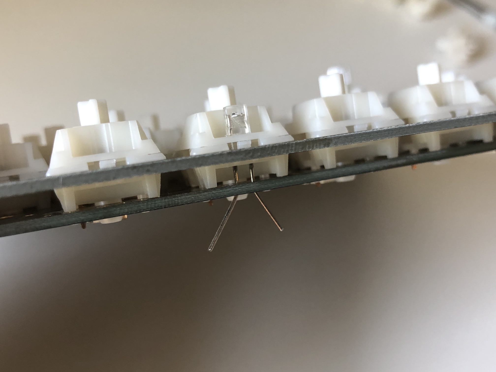
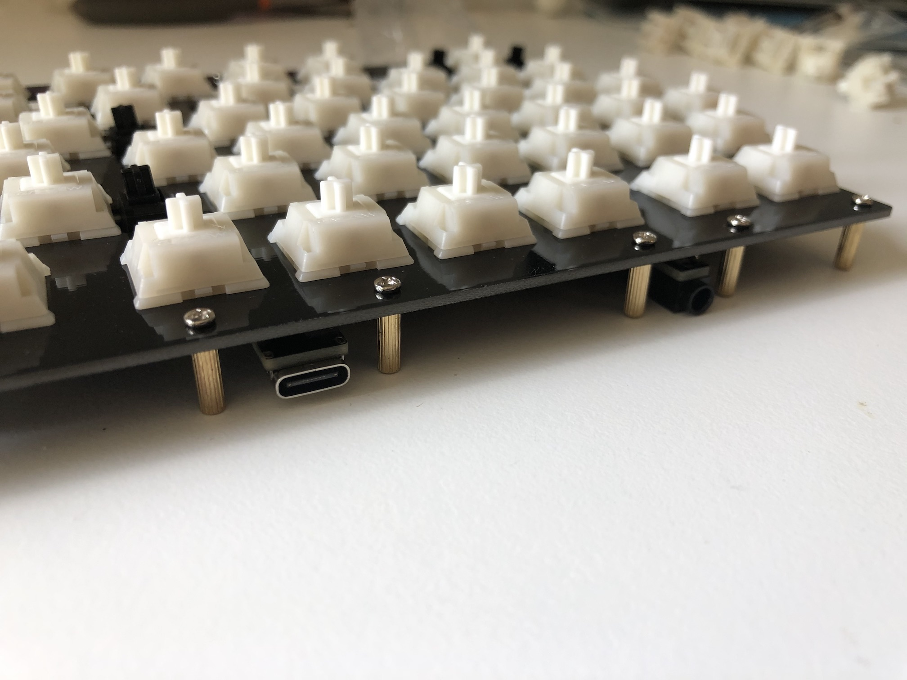

## Build Compatibility

This build guide is exclusively for Quefrency Rev. 2 or higher, Sinc, and KBO-5000! They both have pre-soldered components. If you have the Quefrency Rev. 1 PCBs, see [Quefrency Rev. 1 Build Guide](quefrency-rev1-build-guide.md).

## Videos of Builds

Here are some cool folks who have built these keyboards! Give them a look to see how they do it.

* [FrostyKoala - Prototype Quefrency Rev. 2 Build](https://youtu.be/C-eKjwpLnfI)
* [FrostyKoala - Prototype Sinc Rev. 1 Build](https://youtu.be/3_U_SxKhygA)
* [VogonPT - Prototype Sinc Rev. 1 Build Stream](https://youtu.be/zpeZihPfzIU?t=40)

## Parts List

Now you've watched some cool videos and feel inspired! Get your parts:

* PCBs:
    * [Set of Quefrency PCBs](https://keeb.io/products/quefrency-rev-2-60-65-split-staggered-keyboard)
    * [Set of Sinc PCBs](https://keeb.io/products/sinc-split-staggered-75-keyboard)
    * [Set of KBO-5000 PCBs](https://keeb.io/products/kbo-5000-split-staggered-80-keyboard)
* Plates:
    * [Plates for Quefrency](https://keeb.io/products/quefrency-rev-2-60-65-split-staggered-keyboard)
    * [Plates for Sinc](https://keeb.io/products/sinc-split-staggered-75-keyboard)
    * [Plates for KBO-5000](https://keeb.io/products/kbo-5000-split-staggered-80-keyboard)
* Interconnect Cable:
    * [TRRS cable](https://keeb.io/products/trrs-cable) (for boards that use TRRS, like the Quefrency Rev. 2 or Sinc Rev. 1)
    * [USB-C to USB-C cable](https://keeb.io/products/usb-c-to-usb-c-cable) (for boards that use USB-C for interconnect)
* Switches (MX-compatible ones)
* Optional parts:
    * [2u PCB mount MX stabilizers](https://keeb.io/products/cherry-mx-stabilizer) if using 2u/2.25u/2.75u keys
    * [Rotary Encoder](https://keeb.io/products/rotary-encoder-ec11) and [Knob](https://keeb.io/products/rotary-encoder-knob-ec11)

## Build Steps Summary

1. Prepare components
2. Break off PCB sections
3. Add 2u [stabilizers](glossary#stabilizers) to [PCB](glossary#pcb)
4. Add switches
5. Optional Stuff!
    * Solder [rotary encoder](glossary#rotary-encoder) (optional)
    * Solder in-switch [LEDs](glossary#led) (optional)
        * Note: For Kalih Box switches, LEDs must be installed before the switches.
6. Assemble!
    * Insert [standoffs](glossary#standoffs) into middle layer (optional)
    * Screw standoffs into switch plate
    * attach bottom plate using screws
7. Re-Programing Board Note
8. Rejoice!
9. Glossary

## Prepare Components

Have your soldering iron, solder, and if you feel accident prone with your soldering (It's okay! Happens to the best of us!), a solder sucker. See [Recommended Soldering Tools](soldering-tools.md) if you need some recommendations.

Some individuals may want to lubricate their switches. If you'd like to, go ahead and do that now before starting the process. For further details on that, go [here](https://www.maketecheasier.com/how-to-lubricate-keyboard-switches/).

<!-- TODO: make keebio version of the 'how to' on the aforementioned page. -->

Get a playlist of some jams you like and get started!

## Break Off PCB Sections

If you're going to go with a layout without the left macro section or right macro column, then break off those portions of the PCB. No special tools or methods are required, you can just break it off with your hands as shown below:

<video width="100%" controls muted loop>
  <source src="/videos/pcb-break.mp4" type="video/mp4" />
</video>

## Add 2u stabilizers to PCB

Add the 2u stabilizers into the PCB. The stab wire will be on the bottom side of the switch for everywhere except for the bottom row. On the bottom row, the stab wire will be above the switch. Do this before installing the switch plate and switches, as stabilizers can not be removed after the switches have been soldered in.

Afterwards, fit the plate over the stabilizer(s).

## Add Switches

Now on to the exciting part: putting the switches in the switch plate and solder.

:::note If using Kailh Box switches
There is no cutout to insert in-switch LEDs, so the LEDs must be added *first*. If you're adding LEDs, first do the [LED installation step](#solder-in-switch-leds) and **then** come back to this step of switch installation.
:::

Add switches into the switch plate. It's a good idea to add switches to the corners **first** and then solder them before installing the rest of them:

Solder the switches onto the PCB.

Add the rest of the switches and solder them.

## Optional Stuff!

### Solder Rotary Encoder

:::note Rotary Encoder Installation
This step can be done after installing the switches. For the prototype plates, the encoders had to be installed first, but for the plates available on the store, the switch cutouts are now large enough to allow the encoders to be installed later.
:::

Install the encoder onto the PCB and solder the 2 pins at the top side of the encoder and the 3 pins at the bottom side. The 2 side legs do not need to be soldered to the PCB.

### Solder in-switch LEDs

Polarity of the in-switch LEDs is important. Match up the longer leg of the LED to the `+` sign of the LED pins on the PCB. The shorter leg will match the `-` sign.

Insert the LED through the switch and PCB:

Bend the LED legs out so it doesn't fall out while soldering the LED in:

Solder the LED legs and then clip the excess length on the legs. Be careful to not damage the resistor next to the LED pads.

Note that some of the switch layout options have the `-`/`+` markings swapped, so make sure to always put the longer leg through the `+` pad. If you are unsure, plug the PCB in and test the LED before soldering it in.

## Assemble!

Insert a screw through the top of the switch plate and attach a standoff from the bottom side of the plate:

Repeat the process for the rest of the plate.

:::note
If you have a middle layer, *now* is the time to insert it around the standoffs.
:::

Put bottom plate on and add screws:

## Re-Programming Board Note

Oh, looking to re-program your board? Never fear! Come look [here](flashing-firmware). 

## Rejoice!

You have a keyboard! Savor this moment of victorious keyboard construction.
