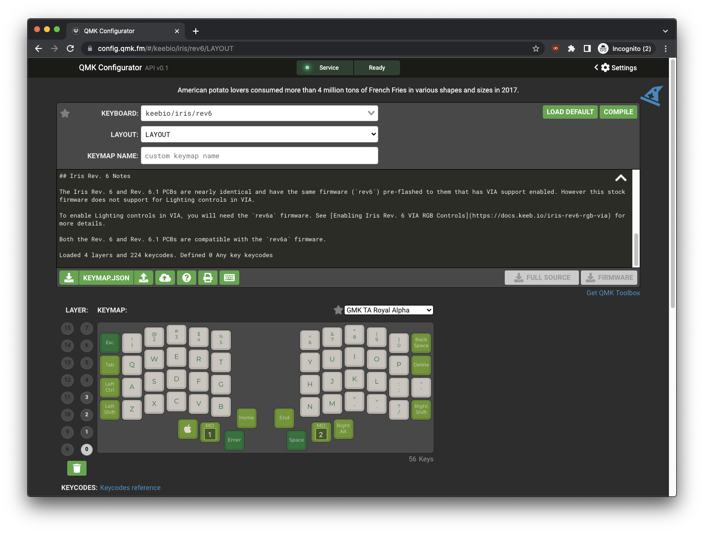

If you'd like to change what each key on your keyboard does, this process is called remapping, as you're changing what's called a keymap on your board. There are a few ways this can be done, each with its pros and cons and also varying degree of of difficulty.

## What is QMK?

First of all, every board at [Keebio](https://keeb.io) is compatible with [QMK Firmware](https://qmk.fm) and are all pre-flashed with a [default QMK Firmware and keymap](default-keymaps.md). [QMK Firmware](https://qmk.fm) is an open-source keyboard firmware, and most keyboards within the mechanical keyboard community use QMK. QMK also encompasses a suite of other tools, such as [QMK Configurator](https://config.qmk.fm/) and [QMK Toolbox](https://github.com/qmk/qmk_toolbox).

QMK Firmware has a lots of features, like supporting multiple layers, macros, Mod-Tap, mouse keys, split keyboards, backlighting, RGB, etc., which makes is a popular choice for hobbyists. There are alternative keyboard firmwares out there, but these are not officially supported by Keebio.

## Remapping Options

There are 3 main options for changing your board's keymap, ordered from least difficult to most difficult to use:

- VIA Configurator
- QMK Configurator
- QMK Firmware build environment

Here are some pros and cons of each method:

- [VIA Configurator](#via-configurator)
    - Pros: Easist to use, instant keymap updates, no flashing firmware required, live lighting controls, layout option controls, macro editor
    - Cons: Does not support every board, can't remap encoders, limit of 4 layers, infrequent updates
- [QMK Configurator](#qmk-configurator)
    - Pros: Stays up to date with QMK firmware, all boards in QMK repository are supported
    - Cons: Need to reflash board to update keymap, can't remap encoders
- QMK Build Environment
    - Pros: Can reconfigure encoders, access to more features like tap dance
    - Cons: Can be complex to setup, involves editing code and using Git

## VIA Configurator

For VIA usage instructions, see [VIA Usage Guide](via.md).

## QMK Configurator

For [QMK Configurator](https://config.qmk.fm), see the [QMK Configurator Guide](https://docs.qmk.fm/#/configurator_step_by_step)

## QMK Firmware Build Environment

Setting up a QMK build environment and compiling your own firmware provides the most flexibility in terms of features and control, but it is also the most complicated of the options out there.

Note that not all features of QMK are supported by the VIA Configurator, so if you want to use more advanced features of QMK like Tap Dance, then you'll need to setup a [QMK build environment](https://docs.qmk.fm/#/newbs_getting_started). By default on most VIA-supported keyboards, there is a limit of 4 layers. This can sometimes be increased, but once again, this requires setting up a QMK build environment.

## Flashing Your Keyboard

If using either QMK Configurator or a QMK Firmware build environment, you'll need to flash the generated .hex/.bin file to your keyboard. See [Flashing Firmware](flashing-firmware.md) for details about doing this.
