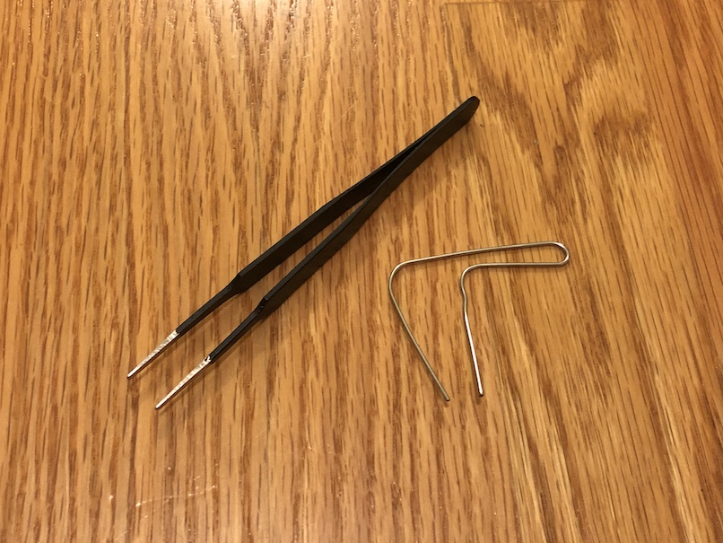
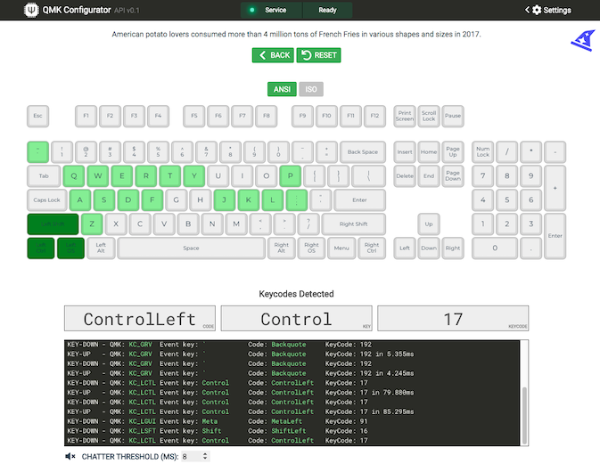

Note: This guide mainly applies to PCBs with on-board components already installed, and not PCBs that come bare and need a Pro Micro-compatible controller added to it. However, once you solder the controller to the PCB and install all the diodes for those type of PCBs, you can use this guide.

## Why Test Your PCB

Before soldering switches to your PCB, it's a good idea to it to make sure that there aren't any issues with it. In case there is an issue with the PCB, you'd be able to request a replacement PCB more easily.

## Equipment You'll Need

To test your PCB, you'll need something electrically conductive to connect the two switch pin pads of a key. Here's a few things you can use:

- Tweezers
- Bent Paperclip
- Wire

## Key Tester Software

Next, you'll need something that can show you what keys have been pressed on the keyboard. Here's a few recommendations:

- [QMK Configurator - Test Keyboard](https://config.qmk.fm/#/test) (Online - works for any OS)
- [VIA](https://caniusevia.com/) (Windows, macOS, Linux)
    - Use the `KEY TESTER` tab
    - If your keyboard PCB has VIA support, then you can also test the keyboard matrix to check for keys that don't register, like `Fn`, in a normal key tester
- [Karabiner-Elements](https://karabiner-elements.pqrs.org/) (macOS)
    - Open up Event Viewer within Karabiner-Elements

## How to Test Key Postions

Now that you've got everything to need to test your PCB, it's time to begin. Here's the steps:

1. Plug the PCB into the computer via USB cable
2. For each key position, take whatever you're using to connect the switch pin pads and touch both of them at the same time
3. A key press should be detected by the tester software, unless it's a special key (see note below)
4. Test all of the key positions in this manner

###  Special/Layer Keys can't be directly tested

Some keys, like `Fn`/layer keys, lighting controls, etc. are unable to be detected using a key tester. That's because a key tester can only detect keycodes that a keyboard sends to the computer, whereas for these special codes, they are handled internally by the keyboard firmware and aren't sent to the computer.

To test an `Fn`/layer key, you'll need to use one hand to hold that key down with your tool, while connecting the switch pin pads together for another key that uses the `Fn`/layer key. Then see if the key tester will detect a key press. For example, on some PCBs, holding down `Fn` while pressing `1` will output `F1` to a computer.

If your keyboard has VIA support, then you can also test these keys by opening up VIA, going to the `KEY TESTER` tab and then selecting `Test Matrix`. You will then see the special keys light up in the app when pressed.

## Split Keyboard Testing

For split keyboards, we recommend that you test your PCBs in the following configurations:

1. USB plugged into left half without being attached to the right half
2. USB plugged into right half without being attached to the left half
3. Once the first two tests are complete, unplug the USB, connect both halves together (using TRRS cable to USB-C-to-C cable, depending on board), then plug in USB into left half
4. Move USB to the right half
