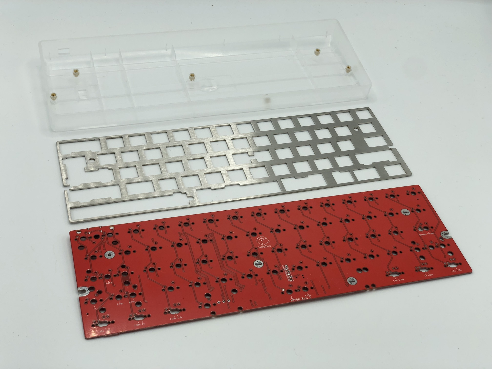
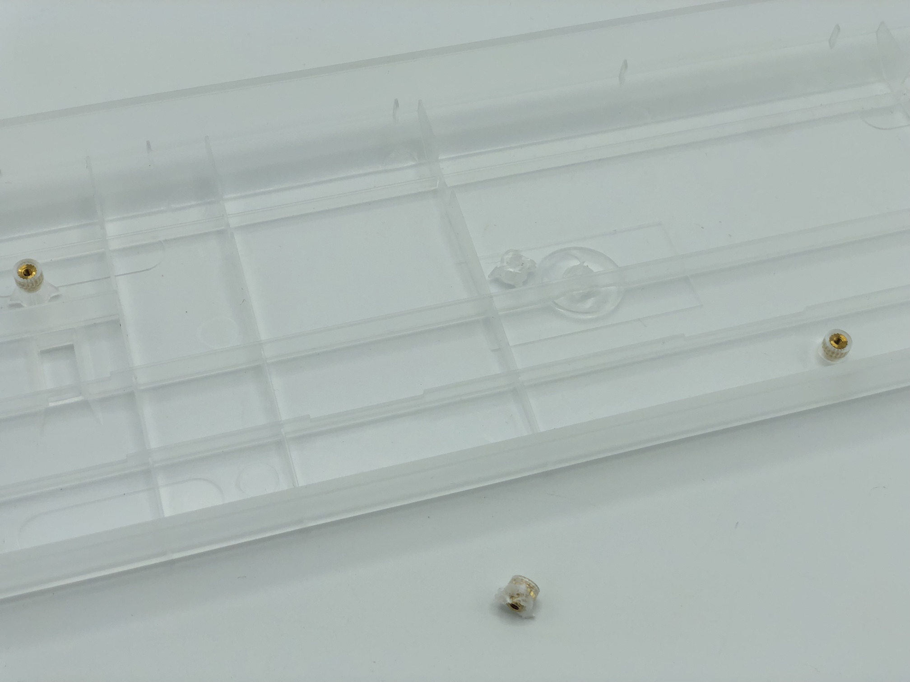
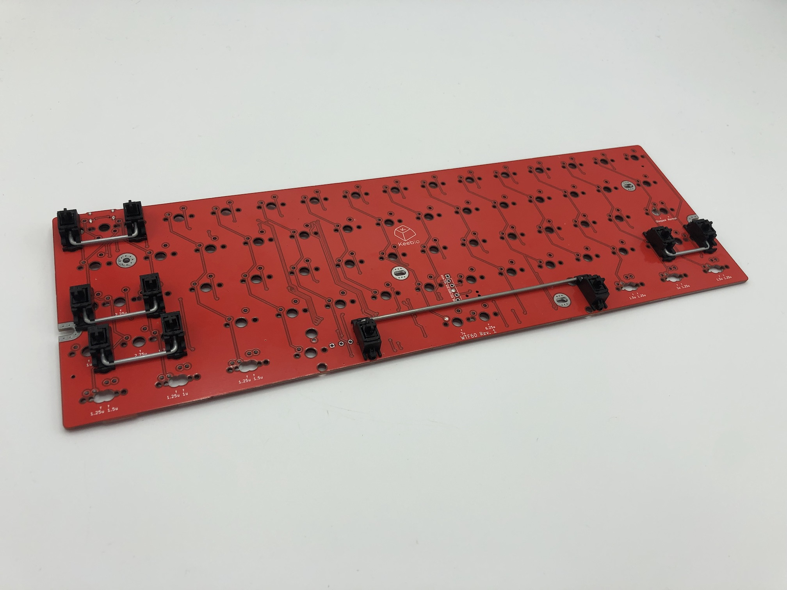
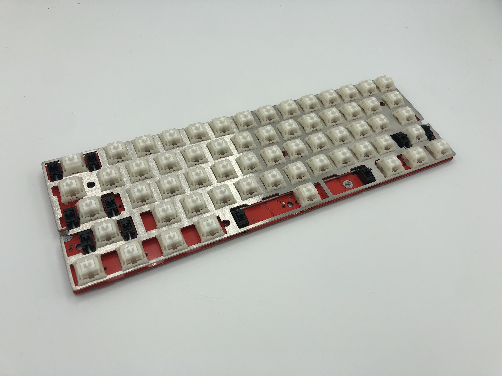
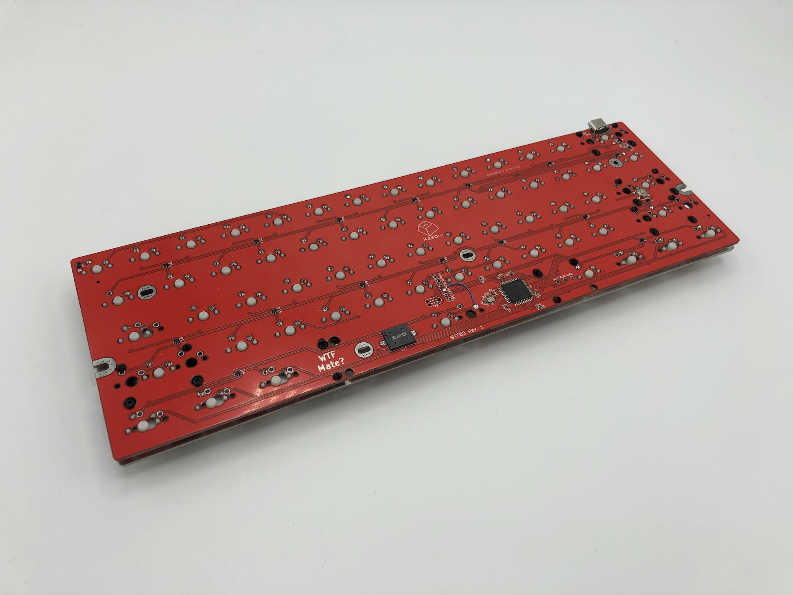
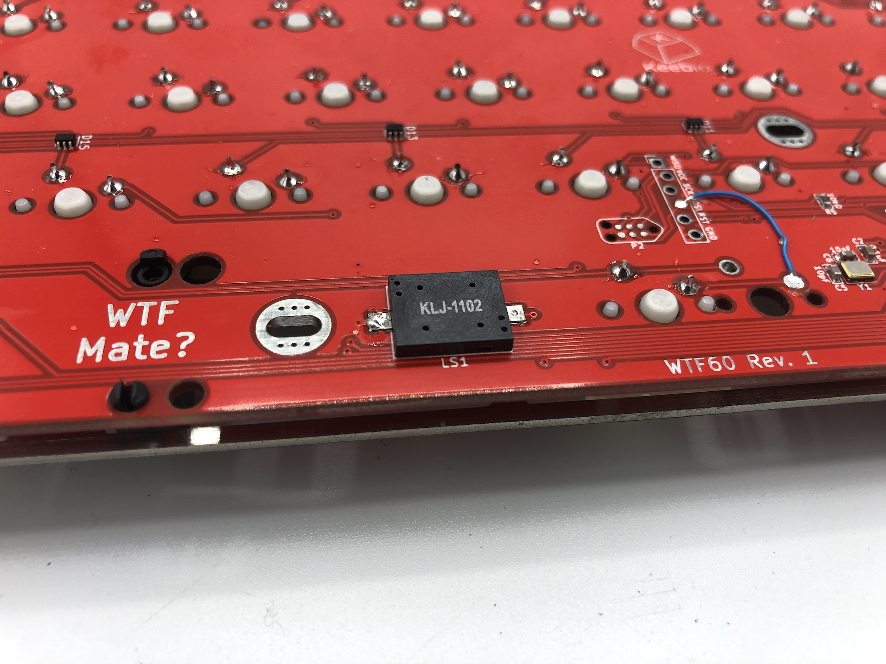
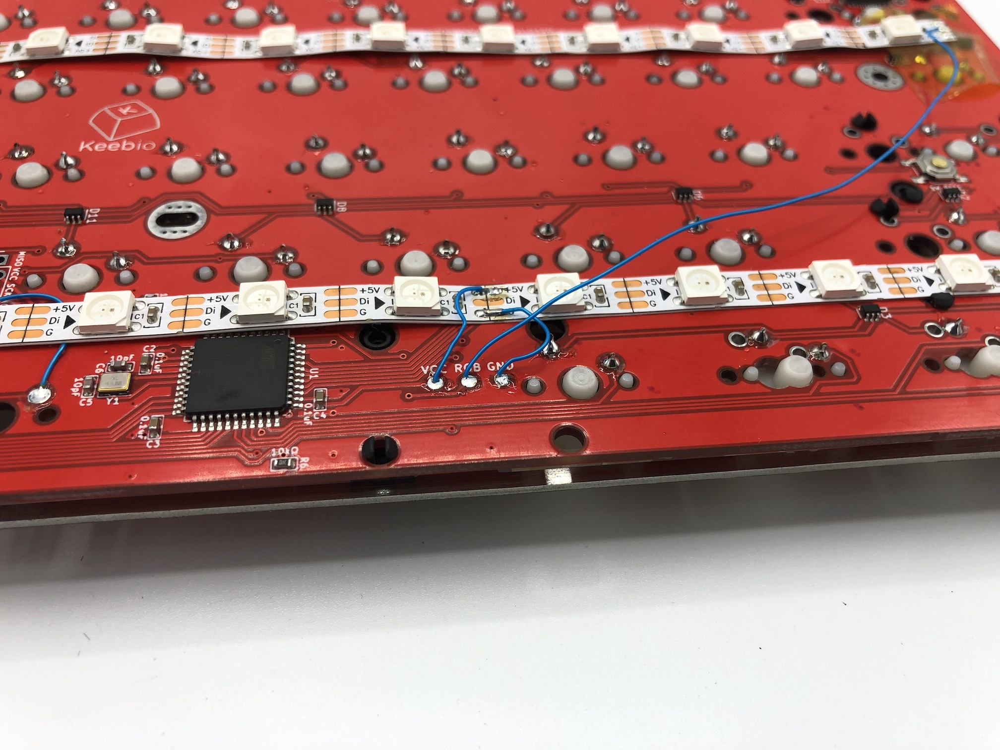
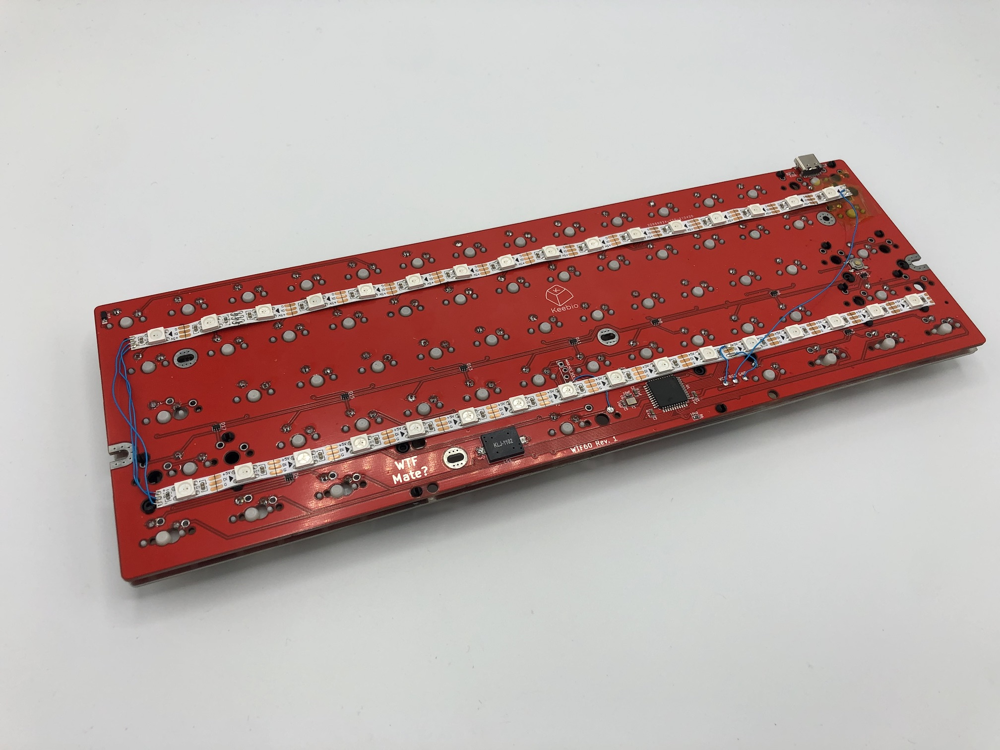
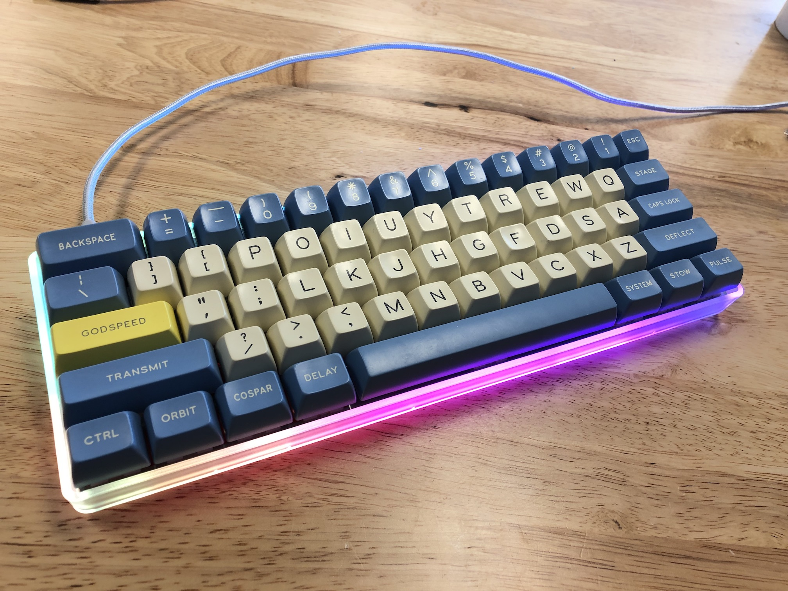

## Parts List

Now you've watched some cool videos and feel inspired! Get your parts:

* [WTF60 PCB](https://keeb.io/products/wtf60-mirrored-60-keyboard-pcb)
* 60% keyboard case
* 60% plate (optional)
* Switches (MX-compatible ones)
* [2u PCB mount MX stabilizers](https://keeb.io/products/cherry-mx-stabilizer)
* 6.25u or 7u PCB mount MX stabilizer

## Build Steps Summary

1. Cut down center standoff on case
2. Add 2u [stabilizers](glossary#stabilizers) to [PCB](glossary#pcb)
3. Add switches
4. Optional Stuff!
    * Solder piezo speaker
    * Add RGB strips
5. Assemble!
6. Re-Programing Board Note
7. Rejoice!

## Cut down center standoff on case

Since the center standoff of the 60% case will interfere with the stem of one of the switches on the PCB, that standoff needs to be cutoff or shaved down, depending on the case material. The whole piece doesn't necessarily need to be cut off, just about 4-5mm so that the center switch stem won't hit it when the PCB is installed.

## Add 2u stabilizers to PCB

Add the 2u stabilizers into the PCB. The stab wire will be on the bottom side of the switch for everywhere except for the bottom row. On the bottom row, the stab wire will be above the switch. Do this before installing the switch plate and switches, as stabilizers can not be removed after the switches have been soldered in.

Afterwards, fit the plate over the stabilizer(s).

## Add Switches

Add switches into the switch plate and into the PCB.

Flip the PCB and plate combo over and solder the switches onto the PCB.

## Optional Stuff!

### Solder Piezo Speaker

If you'd like you keyboard to make some funny noises, then add a piezo speaker!

First, tin both pads of the `LS1` spot on the PCB with solder. Then place the speaker on top of the pads and heat each pad one at a time to solder the speaker on.

### Add RGB Strips

The WTF60 PCB has 3 breakout pins for VCC, GND, and RGB. You can use these to add RGB underglow support.

Make sure that the RGB breakout pad is connected to the first Di/Din pad of the RGB strip. VCC and GND can be connected to any part of the strip.

The default configuration for the WTF60 in QMK does not have RGB LEDs enabled, so you will have to turn that on yourself in rules.mk and compile the firmware. Also adjust the number of RGB LEDs that are using at this time.

## Assemble!

Insert screws through the plate to secure the PCB to the standoffs on the case.

## Re-Programming Board Note

Oh, looking to re-program your board? Never fear! Come look [here](flashing-firmware). 

## Rejoice!

You now have one of the wackiest keyboards out there now! Plug your keyboard in and start working on boosting your WPM.

